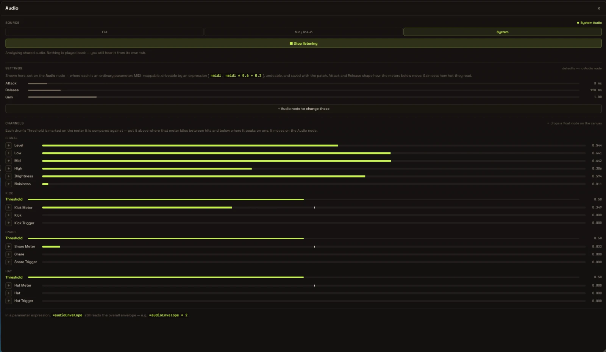

# Audio Envelope User Guide

> **This page documents the standalone Python audio server** in `audio/`, which
> runs as a separate process and exposes envelope values over WebSocket and
> HTTP. The editor no longer connects to it: audio analysis runs in the browser,
> from a file, microphone or shared system audio, with no server to start. For
> that — the route almost everyone wants — see
> **[Working with Audio](audio-web.md)**.

## Overview

The Audio Envelope feature allows you to control shader parameters in real-time based on audio input (microphone or desktop audio). This creates dynamic, audio-reactive visuals that respond to music, voice, or any other sound.

## Quick Start

### 1. Start the Audio Server

First, you need to start the audio server that captures audio and processes the envelope:

```bash
# Navigate to the audio directory
cd audio

# Install dependencies (first time only)
pip install -r requirements.txt

# Start the server with microphone input
python -m audio.audio_server --mode mic

# OR use desktop audio (loopback)
python -m audio.audio_server --mode loopback
```

You should see output like:
```
Audio engine started (mode: mic, rate: 48000Hz)
Audio envelope server running on http://localhost:8765
WebSocket endpoint: ws://localhost:8765/ws
HTTP endpoint: http://localhost:8765/envelope
Update rate: 60 Hz
```

### 2. Read the envelope

The editor has no client for this server — it does its own analysis in the
browser, and its Audio panel neither connects to `localhost:8765` nor shows a
connection status. Consume the server from your own code instead, over either
endpoint:

```bash
# One reading
curl http://localhost:8765/envelope

# A stream of them
websocat ws://localhost:8765/ws
```

Both are documented under [API Reference](#api-reference) below.

### 3. Use audio in parameters

To drive parameters from *the editor's own* analysis — which is what
`audioEnvelope` reads — open **Tools → Audio…** and start a source, then prefix
any parameter expression with `=`. See
**[Working with Audio](audio-web.md)**. The expression syntax below applies
either way:

**Example 1: Basic usage**
```
=audioEnvelope
```
This will directly use the audio envelope value (0.0 to 1.0).

**Example 2: Scale the value**
```
=audioEnvelope * 5.0
```
Multiply the envelope by 5 to get values from 0 to 5.

**Example 3: Add offset**
```
=audioEnvelope + 0.5
```
Add a base value of 0.5, so values range from 0.5 to 1.5.

**Example 4: Use with lerp**
```
=lerp(1.0, 10.0, audioEnvelope)
```
Interpolate between 1.0 and 10.0 based on audio.

**Example 5: Combine with time**
```
=sin(time) * audioEnvelope
```
Create pulsing effects that are modulated by audio.

## Audio Settings Panel



The editor's Audio panel — **Tools → Audio…** (`Cmd/Ctrl+Alt+A`) — drives the
in-browser analysis, not the server on this page. It carries three source tabs
(File, Mic / line-in, System), readouts for the meter shaping (**Attack**,
**Release**, **Gain**), and a live meter for every analysis channel with a **＋**
that deploys an Audio Value node reading it.

Nothing in that panel is editable. The settings are parameters of the **Audio
node**, which is the only place they can be set — so each is MIDI-learnable,
expression-drivable, undoable and saved with the patch. With no Audio node in
the patch the analysis runs on the defaults and the panel offers to add one.

The older Follower / ADSR / Shaping controls this section used to describe are
gone; there is no Threshold, Decay, Sustain, Curve or Auto-normalize control any
more. See **[Working with Audio](audio-web.md)** for the panel as it now stands.

## Use Cases & Examples

### 1. Audio-Reactive Circle Radius

Create a circle that grows with audio:

1. Add a **CircleField** node
2. Set the radius parameter to: `=audioEnvelope * 5.0`
3. The circle will pulse with the audio

### 2. Color Intensity

Make colors brighter with audio:

1. Add a **Colorize** or any color node
2. Set intensity/brightness to: `=lerp(0.2, 1.0, audioEnvelope)`
3. Colors will brighten with louder audio

### 3. Rotation Speed

Spin faster with louder sounds:

1. Add a **Rotate** node
2. Set angle to: `=time * (1.0 + audioEnvelope * 10.0)`
3. Rotation speed increases with audio

### 4. Pattern Frequency

Create more detailed patterns with audio:

1. Add a **Noise** or pattern node
2. Set frequency to: `=2.0 + audioEnvelope * 8.0`
3. Pattern becomes more detailed with sound

### 5. Multiple Parameters

Combine audio with multiple parameters:

```
# Node A - Rotation
angle: =time * audioEnvelope

# Node B - Scale
scale: =1.0 + audioEnvelope * 0.5

# Node C - Color hue
hue: =audioEnvelope * 360
```

## Troubleshooting

### Server won't start
- **Error: "No module named sounddevice"**
  - Run: `pip install -r requirements.txt`

- **Error: "No audio input devices found"**
  - Check your system audio settings
  - Make sure a microphone is connected (for `mic` mode)
  - For `loopback` mode, check if your OS supports it

### Frontend won't connect
- **Status shows "Disconnected"**
  - Make sure the server is running (`python -m audio.audio_server`)
  - Check the browser console for errors
  - Verify the server is running on `localhost:8765`
  - Try refreshing the page

### No audio response
- **Value stays at 0.000**
  - Make some noise into your microphone
  - Try lowering the follower **threshold** (`POST /config`, see below)
  - Check your system's microphone permissions
  - Verify the correct audio input is selected in system settings

### Jerky/stuttering visuals
- **Reduce update rate**:
  ```bash
  python -m audio.audio_server --rate 30
  ```
- **Increase the follower `release_ms`** for smoother decay
- **Use the `exp` or `sigmoid` shaping curve** instead of `linear`

## Advanced Tips

These tune the server's own envelope processor, which is configured over HTTP
(`POST /config`) rather than from any panel in the editor — see
[HTTP Endpoints](#http-endpoints) below for the full payload.

### 1. Smooth Transitions

For smoother audio response, increase the Follower Release time:
- Release: 300-500ms for smooth transitions
- Release: 50-100ms for snappy, beat-reactive effects

### 2. Beat Detection

For beat-reactive effects:
- Set the follower `threshold` higher (0.3-0.5)
- Use a low follower `attack_ms` (10-30 ms)
- Use a medium follower `release_ms` (100-200 ms)

### 3. Ambient Response

For gentle ambient reactions:
- Set the follower `threshold` lower (0.05-0.15)
- Use a medium follower `attack_ms` (100-200 ms)
- Use a long follower `release_ms` (400-800 ms)
- Use the `sigmoid` shaping curve for smooth response

### 4. Combining Multiple Effects

Layer audio effects by using different mappings:
```
# Node A - Fast response
param1: =audioEnvelope

# Node B - Slow response (manually smooth)
param2: =audioEnvelope * 0.3 + 0.7

# Node C - Inverted
param3: =1.0 - audioEnvelope
```

## Server Command-Line Options

```bash
python -m audio.audio_server [options]

Options:
  --host HOST         Server host (default: localhost)
  --port PORT         Server port (default: 8765)
  --mode MODE         Audio mode: mic or loopback (default: mic)
  --rate RATE         Update rate in Hz (default: 60)

Examples:
  # Use microphone with 30Hz update rate
  python -m audio.audio_server --mode mic --rate 30

  # Use desktop audio on all network interfaces
  python -m audio.audio_server --mode loopback --host 0.0.0.0

  # Use custom port
  python -m audio.audio_server --port 9000
```

## API Reference

### HTTP Endpoints

**Get current envelope value:**
```
GET http://localhost:8765/envelope

Response:
{
  "envelope": 0.75,
  "timestamp": 1234567890.123
}
```

**Get server status:**
```
GET http://localhost:8765/status

Response:
{
  "status": "running",
  "clients": 2,
  "mode": "mic",
  "samplerate": 48000
}
```

**Update configuration:**
```
POST http://localhost:8765/config
Content-Type: application/json

{
  "follower": {
    "attack_ms": 50.0,
    "release_ms": 200.0,
    "threshold": 0.1
  },
  "adsr": {
    "attack_ms": 120.0,
    "decay_ms": 180.0,
    "sustain": 0.7,
    "release_ms": 600.0
  },
  "shaping": {
    "curve": "exp",
    "normalize": true
  }
}
```

### WebSocket

**Connect to WebSocket:**
```javascript
const ws = new WebSocket('ws://localhost:8765/ws');

ws.onmessage = (event) => {
  const data = JSON.parse(event.data);
  console.log('Audio envelope:', data.value);
};
```

**Message format:**
```json
{
  "type": "envelope",
  "value": 0.75,
  "timestamp": 1234567890.123
}
```

## Performance Considerations

- **Update Rate**: 60Hz is good for most use cases. Use 30Hz if experiencing performance issues.
- **Multiple Clients**: The server can handle multiple browser tabs/clients simultaneously.
- **CPU Usage**: Audio processing is lightweight (<5% CPU on modern systems).
- **Latency**: Typical latency is 20-50ms from audio input to visual update.

## Security Notes

- The audio server runs locally on your machine
- By default, it only accepts connections from localhost
- To allow remote connections, use `--host 0.0.0.0` (not recommended for public networks)
- No audio data is stored or transmitted beyond your local machine

## Support

If you encounter issues:

1. Check the browser console for JavaScript errors
2. Check the server console for Python errors
3. Verify audio permissions in your OS settings
4. Try the `/status` endpoint to check server health
5. Restart both the server and the browser

## What's Next?

Try experimenting with:
- Different audio sources (music, voice, ambient sounds)
- Multiple parameters controlled by audio
- Combining audio with other expressions (time, math functions)
- Creating complex audio-reactive compositions
- Recording your audio-reactive creations

Enjoy creating audio-reactive visuals!
