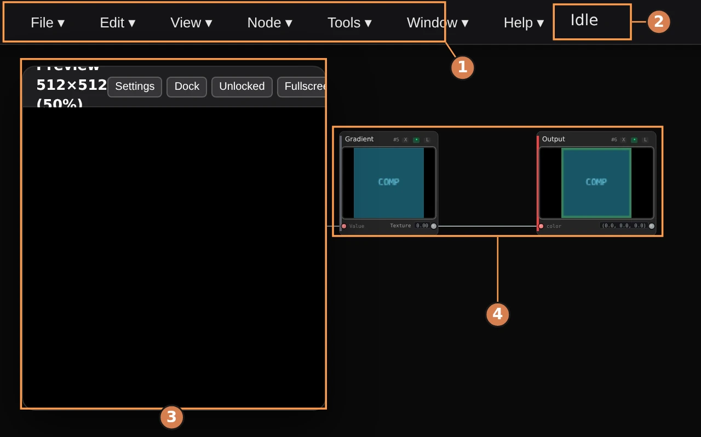
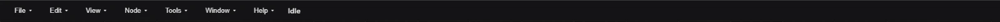
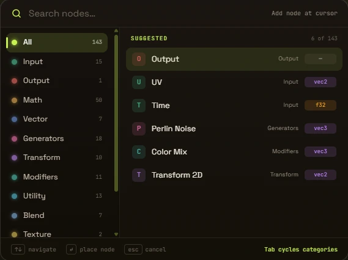
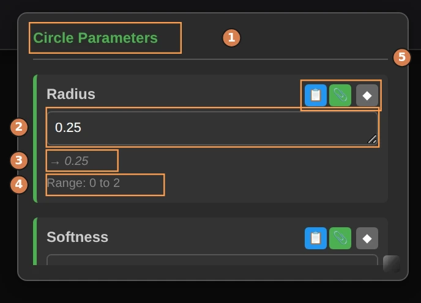
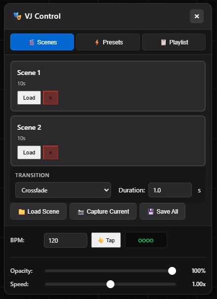

# Interface Overview

Get familiar with the Rhizomium interface and learn how to navigate the editor efficiently.

---

## Main Interface Elements

When you open Rhizomium, you'll see four main areas:

1. **Menu bar** - File, Edit, View, Node, Tools, Window, Help
2. **Status** - "Idle" or "Shader compiled"
3. **Preview window** - the rendered output, floating over the canvas
4. **Canvas** - the node graph you are building

### 1. Canvas (Center)

The large dark area where you build your node graphs.

- **Background grid** helps align nodes
- **Zoom in/out** with mouse wheel
- **Pan** by middle-clicking and dragging
- **Select nodes** by clicking them
- **Box select** by right-click dragging

### 2. Menu Bar (Top)

Everything outside the canvas lives in seven menus, with the current status
("Idle", "Shader compiled") shown beside them:

**File** - New Project, Open Project…, Save, Save As…, File Manager, Export,
Publish (**Publish Image…** and **Publish Animation…**, which upload at the
render resolution set in **View → Preview / Export Settings**), Backups, Exit

**Edit** - Undo, Redo, Cut, Copy, Paste, Delete, Rebuild, Preferences…

**View** - Panels (Toggle ParamPanel, Toggle Preview Panel, Toggle 3D
Viewport), Zoom (Zoom In, Zoom Out, Reset Zoom), Grid (Show Grid, Snap to
Grid, Grid Size), Preview / Export Settings, Show Console, Timeline,
VJ Control, Open / Close Output, Output Screens…

**Node** - Create Node…, Delete Node, Duplicate Node, Pins (Connect Pins,
Disconnect Pins), Node Settings / Params…

**Tools** - Script Editor / Python Console, Shader Tools (Shader Compiler,
GLSL Utilities), Audio Settings, MIDI Settings

**Window** - Layouts (Default, Custom, Minimal, Save Current as Custom),
Floating Windows, Reset Layout

**Default** is what the editor boots into: the preview over the graph. (Not
the parameter panel - that one follows your selection and closes itself when
you click away, so no layout opens it.) **Minimal** leaves nothing but the
node graph. **Custom** is your own
arrangement - **Save Current as Custom** writes it from whatever is open at
the time, tool windows included, and it survives a restart.

**Floating Windows** clears every panel out of the way and puts exactly the
same ones back on the second press, which is the quick way to read a wide
patch without losing the panels you had open. **Reset Layout** is the way
back from a panel dragged off screen: the default arrangement, with every
window at the position and size it opens with.

**Help** - Documentation, Shortcuts / Keymap, Welcome, About

The preview window carries its own controls rather than sitting in a toolbar -
see [Preview Window](#preview-window) below.

### 3. Preview Window

Shows your visual output in real-time:

- **Floating or docked** - Choose your layout
- **Resizable** - Drag corners to resize
- **Drag to move** - Click and drag to reposition
- **Control buttons** in top-right:
  - Close button
  - Fullscreen button
  - Lock button

### 4. Right-Click Menu

Right-clicking empty canvas opens the **Add Node** palette - a search field
over a rail of the twelve node categories:

The categories are **Input**, **Output**, **Math**, **Vector**, **Generators**,
**Transform**, **Modifiers**, **Utility**, **Blend**, **Texture**,
**Dynamics** and **Effects**. Pick one from the rail to list just its nodes, or
stay on **All** and type - the search matches every node in the editor by name,
so you never have to remember which category something is filed under.

- **Type** to search
- **Arrow keys** to move the selection
- **Enter** to place the highlighted node
- **Tab** to cycle through the categories
- **Esc** to close without placing anything

The node lands at the cursor, so right-click where you want it.

**On a node**, right-click gives that node's own menu - edit parameters, delete,
duplicate, and toggle its preview thumbnail. It also offers **Reset parameters
to default**, which appears only once a value has been changed; it applies to
the whole selection and undoes in one step.

---

## Canvas Controls

### Navigation

**Panning:**
- Middle-click + drag
- Two-finger drag (trackpad)
- Right-click + drag (when not over nodes)

**Zooming:**
- Mouse wheel up/down
- Pinch gesture (trackpad)
- Ctrl + drag up/down
- Zoom centers on cursor position

**Framing:**
- Press **F** to frame selected nodes
- Press **F** with nothing selected to frame all nodes

### Selection

**Single Selection:**
- Click a node to select it
- Selected nodes have a highlight border
- Click canvas to deselect

**Multiple Selection:**
- Hold Shift + click to add to selection
- Right-click + drag for box selection
- Box select captures all nodes in rectangle

**Moving Nodes:**
- Click and drag selected nodes
- Arrow keys nudge by 1 pixel
- Shift + Arrow keys nudge by 10 pixels
- With snap enabled, uses grid size

---

## Node Anatomy

Each node has several parts:

### Header
- **Title** - Node type name
- **Color bar** - Category color coding:
  - Green (emerald): Input nodes
  - Amber: Math nodes
  - Cyan: Utility nodes
  - Red: Output node
  - Gray: other categories

### Body
- **Input pins** (left side) - Receive data
- **Output pins** (right side) - Send data
- **Parameters** below inputs
- **Preview thumbnail** (when enabled)

### Controls (Top-right of node)
- **X button** - Hide visual info
- **Eye button** - Toggle preview thumbnail
- **Size button** - Cycle preview size (S/M/L)

### Connection Points
- **Output pins** - Small circles on right side
- **Input pins** - Small squares on left side
- **Hover** to see pin names and types
- **Color coding** indicates data type:
  - White: Float (single number)
  - Yellow: Vec2 (2D vector)
  - Green: Vec3 (3D vector/color)
  - Red: Vec4 (4D vector/RGBA)

---

## Working with Nodes

### Adding Nodes

1. Right-click on canvas to open the radial **Add Node** menu
2. Type to search, or click a category to fan out its nodes
3. Click a node, or highlight it with the arrow keys and press **Enter**
4. Node appears where you right-clicked

**Tip:** Typing is usually faster than browsing - the search covers all 133
nodes regardless of category.

### Connecting Nodes

1. Click and drag from an **output pin** (right side)
2. Drag wire to an **input pin** (left side)
3. Release to create connection
4. Wire color matches data type

**Valid Connections:**
- Output → Input only (left to right)
- One output can connect to many inputs
- One input can only have one connection
- Type mismatches auto-convert when possible

### Disconnecting Nodes

**Method 1:** Click an input pin to remove its connection

**Method 2:** Select connection wire and press Delete

**Method 3:** Drag a new connection to replace old one

### Editing Parameters

**Double-click** a node to open the parameter panel:

- Type values directly into the parameter's field
- Prefix with `=` to drive it from an expression
- Color pickers for color parameters
- Dropdowns for options
- File pickers for textures

**Click outside** the panel to close it

### Deleting Nodes

- Select node(s) and press **Delete** or **Backspace**
- Or right-click node and choose "Delete"
- Connections are removed automatically

---

## Parameter Panel

Opens when you double-click a node, or from **Node → Node Settings / Params…**:

1. **Panel header** - which node these parameters belong to
2. **Value field** - type a number, or an `=` expression
3. **Evaluated value** - what the expression currently resolves to
4. **Accepted range** for this parameter
5. **Copy reference**, **bind** (MIDI / parameter link), and **keyframe**

### Panel Layout
- **Header** - the node's name, e.g. "Circle Parameters"
- **Parameters** - one block each, in the order the node declares them
- **Real-time updates** - changes apply immediately

Each parameter block carries three buttons on the right:

- **Copy reference** - copies this parameter as a reference you can paste into
  another parameter's expression
- **Bind** - opens the binding menu, used for MIDI and parameter links
- **Keyframe** - adds a keyframe at the playhead for timeline animation

### Parameter Types

**Numeric:**
- A text field you type into directly - every numeric parameter accepts a plain
  number or an `=` expression
- Below the field, the editor shows the value it currently evaluates to and the
  accepted range (e.g. "Range: 0 to 2")
- Out-of-range values are clamped to that range

**Color:**
- Color picker interface
- RGB/HSV values
- Hex input
- Swatch preview

**Boolean:**
- Checkbox toggle
- On/Off states

**Dropdown:**
- Click to show options
- Select from list

**File:**
- Browse button
- Drag-and-drop support (textures)

**Expression (=):**
- Click **=** button to enable
- Write math formulas
- Reference `time`, `audioEnvelope`, `mouse.x`, etc.
- Real-time evaluation
- See [Parameter Expressions Guide](parameter-expressions.md) for details

---

## Preview Window

### Window Modes

**Floating Mode:**
- Drag to reposition
- Resize by corners
- Can move off-canvas

**Docked Mode:**
- Snaps to canvas edge
- Resizes with browser
- Stays in bounds

**Locked Mode:**
- Prevents accidental moves
- Unlock to reposition

**Fullscreen Mode:**
- Fills entire screen
- Press Esc to exit
- Hides UI elements

### Node Previews

Individual nodes can show preview thumbnails:

**Per-Node Toggle:**
- Click the eye button on a node to show or hide its thumbnail
- The eye icon reflects the node's current state (open = visible, closed = hidden)
- The on/off state is saved with your graph

**Defaults:**
- Visual nodes (patterns, colors, textures, compute nodes) show a thumbnail by default
- Numeric/scalar nodes (Math, constants, Time, etc.) hide their thumbnail by default — it would only be a flat swatch. Their output value still shows next to the output pin, and the first click on the eye button turns the thumbnail on

**Preview Sizes:**
- **S** (Small) - 32x32 pixels
- **M** (Medium) - 64x64 pixels
- **L** (Large) - 128x128 pixels

**Performance:**
- Small previews = better performance
- Disable previews for complex graphs
- Only visible nodes compute previews

---

## Console Window

View and export generated WGSL shader code:

**Open:** **View → Show Console**

**Features:**
- **Select All** - Highlight all code
- **Copy** - Copy to clipboard
- **Export WGSL** - Save as .wgsl file
- **Close** - Hide console

**Use Cases:**
- Debug shader compilation
- Learn WGSL from your graphs
- Share shader code
- Use in external projects

---

## Shader Compiler

Compile the graph and read what the GPU driver says about it:

**Open:** **Tools → Shader Tools → Shader Compiler** (`Ctrl+Alt+C`)

**Features:**
- **Shader picker** - The fragment shader for the main output, plus each
  compute node's own compute shader
- **Compile** - Rebuilds the shader from the graph as it stands and hands it to
  the driver
- **Errors and warnings** - Listed with line and column, marked on the source
  itself; click one to jump to its line
- **Follow graph** - Recompiles as you edit; switch it off to hold a shader
  still while you read it
- **Copy / Save .wgsl** - The selected shader, not just the main one
- Line count, binding count, function count, parameter uniforms and size along
  the bottom

Without a GPU device the window still shows the source and says it could not
compile it. A patch whose output isn't wired up has no fragment shader yet, and
the window says that too rather than showing an empty view.

---

## GLSL Utilities

The Custom GLSL node takes WGSL; the shader code you arrive with is usually
GLSL. This window is the bridge, and the reference for what a node body may
say:

**Open:** **Tools → Shader Tools → GLSL Utilities** (`Ctrl+Alt+G`)

**Convert** - Paste GLSL, press **Convert to WGSL**. Types, constructors,
casts, function signatures, `mod`, two-argument `atan` and the usual Shadertoy
uniforms (`iTime`) are translated outright. Anything that needs a decision -
a texture lookup, a `?:`, a uniform declaration, `iResolution` - is left in
place and listed underneath with its line number; click a note to select that
line in the source pane. Nothing is dropped silently. **Sample** fills the
pane with a shader to try it on.

**Snippets** - Bodies ready to drop into a Custom GLSL node: polar
coordinates, kaleidoscope fold, hash and value noise, a cosine palette,
vignette, scanlines, circle and box SDFs, a checkerboard, an audio-reactive
ring. Search matches the title, category and the code itself; each snippet
names the Output Type to set on the node.

**Built-ins** - The names a node body can reach for (`uv`, `time`, the audio
envelopes, `input0…input7`, `pi`, `E`) and the rules a body is read by.

**Insert into node** - Writes the conversion or the snippet straight into the
selected Custom GLSL node, as an ordinary parameter edit: it rebuilds the
shader and it undoes. The footer says which node it would write into, or why
it can't.

---

## Audio Settings Panel

Configure audio reactivity:

**Open:** Click "Audio Settings" button

**Controls:**
- **Enable/Disable** - Toggle audio input
- **Input Source** - Choose microphone
- **Gain** - Amplify audio signal (0.5-5.0)
- **Smoothing** - Response speed (0.1-0.9)
- **Frequency Ranges** - Customize bass/mid/high bands

**Visual Feedback:**
- Real-time frequency bars
- Bass, mid, high indicators
- Level meters

See [Audio Reactivity Guide](audio-web.md) for details.

---

## MIDI Settings Panel

Control parameters with MIDI controllers:

**Open:** **Tools → MIDI Settings**

**Features:**
- **Device Detection** - Automatically lists connected MIDI controllers
- **MIDI Learn** - Easy parameter mapping
- **Binding Management** - View and edit MIDI mappings
- **Activity Monitor** - Real-time MIDI input display

**Quick Setup:**
1. Connect MIDI controller via USB
2. Click "Enable MIDI" and grant permission
3. Click parameter field → Click "MIDI Learn"
4. Move controller knob/slider
5. Parameter is now mapped!

See [MIDI Controller Integration Guide](midi.md) for complete instructions.

---

## Timeline Panel

Create keyframe animations:

**Open:** Click "Timeline" button or press **Ctrl+T**

**Features:**
- **Keyframe Editor** - Add, edit, delete keyframes
- **Playback Controls** - Play, pause, scrub timeline
- **Interpolation** - Linear, ease, bezier curves
- **Multiple Tracks** - Animate multiple parameters
- **Loop Support** - Seamless looping animations

**Quick Start:**
1. Enable Timeline toggle
2. Set playhead to start time
3. Adjust parameter value
4. Click "Add Keyframe" (or press K)
5. Move playhead, adjust value, add another keyframe
6. Click Play to see animation!

See [Timeline & Keyframes Guide](timeline.md) for detailed instructions.

---

## VJ Control Panel

Store whole graphs as scenes and switch between them during a performance.

**Open:** **View → VJ Control**

**Tabs** - **Scenes**, **Presets** and **Playlist**.

**Scenes** - each saved scene is listed with its duration and a **Load** button,
plus a red button to remove it. Below the list:

- **Load Scene** - bring a scene in from a file
- **Capture Current** - save the graph as it stands right now into a new scene
- **Save All** - write every scene out

**Transition** - how one scene gives way to the next (for example Crossfade),
and how long the transition takes in seconds.

**BPM** - set the tempo numerically, or click **Tap** in time with the music.
The indicator beside it beats along so you can check the tempo took.

**Opacity** and **Speed** - global sliders over the whole output, so you can
fade the visuals out or run them faster and slower without touching the graph.

---

## Performance Profiler

Monitor real-time performance:

**Open:** View ▸ Compute Profiler, or press **Ctrl+Alt+P**. Hidden by default — while it is open the renderer takes a per-frame GPU timing measurement, which costs performance.

**Displays:**
- **FPS** - Frames per second (target: 60)
- **Frame Time** - Milliseconds per frame
- **Compute Time** - GPU compute shader timing
- **Dispatch Breakdown** - Per-node performance

**Color Coding:**
- Green (≥60 FPS) - Excellent
- Yellow (30-59 FPS) - Acceptable
- Red (<30 FPS) - Poor

**Controls:**
- **+** - Expand to see detailed breakdown
- **−** - Collapse to compact view
- **×** - Close overlay
- **Ctrl+Shift+R** - Reset statistics

See [Performance Profiler Guide](profiler.md) for detailed information.

---

## Status Bar

The strip along the bottom of the canvas, left to right:

**Left** - zoom level, the render toggle (click **Live** to stop and restart
rendering; the graph stays editable), and the cursor position.

**Center** - node and wire counts, how many nodes are selected, and **TYPES**,
which explains the wire colors on hover.

**Right** - timeline position, frame rate, and the status message: Idle,
Compiling..., Saved, Error, Loading...

### Cursor position

The readout follows whichever surface the pointer is over, because they are
different spaces with different origins:

- **Over the graph** - `x 400  y 260`, the position in graph space. This is
  where a node dropped here would sit, and it moves as you pan and zoom.
- **Over the render** - `out x 960  y 540`, the pixel of the output frame
  under the pointer, measured from the frame's top-left. Hover the readout for
  the frame size and the uv coordinate.

So a point in the preview reads as an output pixel whatever size the preview
panel has been dragged to, and it keeps reading that way in the fullscreen
preview and on a second monitor. `out` is the marker that says the number is
in output space rather than graph space.

---

## Tips for Efficient Workflow

### Organization

1. **Use grid snap** - Keep nodes aligned
2. **Group related nodes** - Organize by function
3. **Leave space** - Don't overcrowd canvas
4. **Color categories** - Learn category colors

### Navigation

1. **Learn shortcuts** - See [Keyboard Shortcuts](shortcuts.md)
2. **Use zoom effectively** - Zoom out to see big picture
3. **Frame selection** - Press F to focus
4. **Pan frequently** - Keep relevant nodes visible

### Performance

1. **Disable unused previews** - Saves GPU resources
2. **Lower preview resolution** - For complex graphs
3. **Toggle main preview** - When not needed
4. **Close console** - When not debugging

### Productivity

1. **Duplicate nodes** - Ctrl+D for quick copies
2. **Multi-select** - Shift+click or box select
3. **Arrow key nudging** - Fine-tune positions
4. **Save frequently** - Ctrl+S every few minutes

---

## Customization

### Grid Settings

Adjust snap grid to your preference:
- Small grids (10-15) - Precise placement
- Medium grids (20-30) - Balanced
- Large grids (40-60) - Coarse alignment

### Preview Position

Position preview where it works for you:
- **Right side** - Traditional layout
- **Left side** - Extra canvas space
- **Bottom** - Wide preview
- **Floating** - Separate window

### Resolution

**View → Preview / Export Settings** is the single place render resolution,
frame rate and export options are set - the preview, exports and publishing all
follow it.

**Output format** presets:

- **512 × 512** and **1024 × 1024** (square) - light, good for older GPUs
- **2048 × 2048** (square) - heavy, for stills
- **720p** (1280 × 720) - the default, balanced
- **1080p** (1920 × 1080) - standard HD
- **1440p** (2560 × 1440) - high quality
- **4K** (3840 × 2160) - powerful GPUs only
- **Custom…** - type your own width and height

**Frame rate** is either **V-Sync (display refresh)** or a **fixed step**.

The second-monitor viewer has its own **Viewer Display** setting - Auto, 720p,
1080p, 1440p, 4K, or a custom long edge - so the presentation window can run at
a different size from the render.

---

## Common Questions

### Canvas is zoomed too far in/out?

Use mouse wheel to zoom, or press F to frame all nodes.

### Can't see preview?

Click "Toggle Preview" button, or press Ctrl+P.

### Nodes won't connect?

Check that you're dragging from output (right) to input (left). Some types can't connect.

### Preview shows black screen?

Make sure you have an **Output** node connected to your graph.

### Parameter panel won't open?

Double-click the node. Make sure you're clicking the node body, not a pin.

---

## Next Steps

- **[Keyboard Shortcuts](shortcuts.md)** - Learn all shortcuts
- **[Parameter Expressions](parameter-expressions.md)** - Animate with math
- **[MIDI Controllers](midi.md)** - Hardware control setup
- **[Timeline Animation](timeline.md)** - Keyframe system
- **[Performance Tips](performance.md)** - Optimize your graphs
- **[Performance Profiler](profiler.md)** - Monitor performance
- **[Node Reference](node-reference.md)** - Explore all nodes
- **[Compute Nodes](compute-nodes.md)** - GPU-accelerated effects
- **[Quick Start Guide](quickstart-web.md)** - Build your first graph

---

_Master the interface, unlock your creativity!_
