# Node Reference

This document provides a comprehensive reference for all available nodes in Rhizomium. Nodes are organized by the same categories you see in the editor's add-node menu, and include detailed information about their inputs, outputs, parameters, and functionality.

Two kinds of nodes exist side by side:

- **Fragment nodes** compile directly into the fragment shader (Input, Output, Math, Vector, Transform, Blend, Texture, and the fragment members of Generators/Modifiers/Utility).
- **Compute nodes** (names starting with "Compute", plus Voronoi, Gradient, Pattern, Kaleidoscope, and the Simulation nodes) run as separate GPU compute passes before the fragment shader and output a **texture**. They are marked "(Compute)" below. See the [Compute Nodes guide](compute-nodes.md) for how they fit into a graph.

## Table of Contents

- [Input Nodes](#input-nodes)
- [Output Nodes](#output-nodes)
- [Math Nodes](#math-nodes)
- [Vector Nodes](#vector-nodes)
- [Generator Nodes](#generator-nodes)
- [Transform Nodes](#transform-nodes)
- [Modifier Nodes](#modifier-nodes)
- [Effect Nodes](#effect-nodes)
- [Simulation Nodes](#simulation-nodes)
- [Utility Nodes](#utility-nodes)
- [Blend Nodes](#blend-nodes)
- [Texture Nodes](#texture-nodes)

---

## Input Nodes

Input nodes provide constant values and runtime data sources.

### Constant Values

#### Float
Outputs a single constant floating-point value.

- **Category**: Input
- **Inputs**: None
- **Outputs**:
  - `out` (f32) - The constant float value
- **Parameters**:
  - `Value` (float, default: 0.0) - The constant value to output

#### Vec2
Outputs a constant 2D vector.

- **Category**: Input
- **Inputs**: None
- **Outputs**:
  - `out` (vec2) - The constant 2D vector
- **Parameters**:
  - `X` (float, default: 0.0) - X component
  - `Y` (float, default: 0.0) - Y component

#### Vec3
Outputs a constant 3D vector.

- **Category**: Input
- **Inputs**: None
- **Outputs**:
  - `out` (vec3) - The constant 3D vector
- **Parameters**:
  - `X` (float, default: 0.0) - X component
  - `Y` (float, default: 0.0) - Y component
  - `Z` (float, default: 0.0) - Z component

#### Vec4
Outputs a constant 4D vector.

- **Category**: Input
- **Inputs**: None
- **Outputs**:
  - `out` (vec4) - The constant 4D vector
- **Parameters**:
  - `X` (float, default: 0.0) - X component
  - `Y` (float, default: 0.0) - Y component
  - `Z` (float, default: 0.0) - Z component
  - `W` (float, default: 1.0) - W component

### Runtime Inputs

#### UV
Provides the current fragment's UV coordinates.

- **Category**: Input
- **Inputs**: None
- **Outputs**:
  - `uv` (vec2) - UV coordinates (0-1 range)
- **Parameters**: None
- **Description**: Outputs the current pixel's texture coordinates, typically used as input for sampling textures or generating procedural patterns.

#### Time
Provides the current elapsed time.

- **Category**: Input
- **Inputs**: None
- **Outputs**:
  - `t` (f32) - Elapsed time in seconds
- **Parameters**: None
- **Description**: Outputs continuously increasing time value, useful for animations and time-based effects.

#### Mouse
Provides the current mouse position and click state.

- **Category**: Input
- **Inputs**: None
- **Outputs**:
  - `mouse` (vec4) - Cursor state, following ShaderToy's `iMouse`:
    - `.xy` - Cursor position, normalized to the viewport (0–1, Y up)
    - `.z` - `1.0` while a mouse button is held over the preview, else `0.0`
    - `.w` - `1.0` on the frame a press begins (click), else `0.0`
- **Parameters**: None
- **Description**: Outputs the current mouse cursor position and click state. Use a Split node (or a swizzle) to read individual components — e.g. `.xy` for position, `.z` to test whether the button is held, `.w` to detect a click.

#### Resolution
Provides information about the current viewport resolution.

- **Category**: Input
- **Inputs**: None
- **Outputs**:
  - `res` (vec2) - Resolution as 2D vector (width, height)
  - `width` (f32) - Viewport width in pixels
  - `height` (f32) - Viewport height in pixels
  - `aspect` (f32) - Aspect ratio (width/height)
- **Parameters**:
  - `Mode` (select: Preview/Display, default: Preview) - Which resolution to report
- **Description**: Outputs various resolution metrics useful for aspect-correct scaling and responsive effects. In **Preview** mode the values track the live render canvas size; in **Display** mode they are the monitor's actual native resolution, baked in at compile time (useful when driving an external/second-monitor viewer).

#### Pi
Provides the mathematical constant Pi.

- **Category**: Input
- **Inputs**: None
- **Outputs**:
  - `pi` (f32) - The value of Pi (3.14159...)
- **Parameters**: None
- **Description**: Outputs the constant π, useful for trigonometric calculations.

#### Trigger
Converts a continuous value into a pulse trigger.

- **Category**: Input
- **Inputs**:
  - `value` (f32) - Input value to monitor
- **Outputs**:
  - `pulse` (f32) - Trigger pulse output (0 or 1)
- **Parameters**:
  - `Threshold` (float, default: 0.5) - Activation threshold
- **Description**: Outputs a pulse when the input crosses the threshold, useful for creating discrete events from continuous signals. Pairs naturally with Hold, Count, and the Reset pin on the Feedback nodes.

#### Hold
Samples and holds an input value when triggered.

- **Category**: Input
- **Inputs**:
  - `value` (f32) - Value to sample
  - `pulse` (f32) - Trigger signal
- **Outputs**:
  - `out` (f32) - Held value
- **Parameters**:
  - `Update` (select: Continuous/Once per trigger, default: Continuous) - When to sample
  - `Threshold` (float, default: 0.5) - Trigger threshold
- **Description**: Sample-and-hold. Latches the `value` input while `pulse` crosses the threshold and keeps holding it after the pulse falls back to 0. **Continuous** re-samples every frame the pulse is high; **Once per trigger** samples a single time on the rising edge of each pulse and holds until the next one. The running value lives on the CPU and is streamed into the shader as a per-frame uniform.

#### Count
A counter that advances on each trigger pulse.

- **Category**: Input
- **Inputs**:
  - `pulse` (f32) - Trigger signal
- **Outputs**:
  - `count` (f32) - Current counter value
- **Parameters**:
  - `Step` (float, default: 1.0) - Amount added per pulse
  - `Threshold` (float, default: 0.5) - Pulse detection threshold
  - `Loop` (bool, default: false) - Wrap around the [Min, Max] range
  - `Min` (float, default: 0.0) - Range minimum (used when Loop is on)
  - `Max` (float, default: 10.0) - Range maximum (used when Loop is on)
- **Description**: Advances by `Step` on each rising edge of the pulse input (when it crosses `Threshold`). With **Loop** enabled the count wraps around the [Min, Max] range instead of growing without bound. Like Hold, the running count is maintained on the CPU and streamed in as a per-frame uniform.

#### Random Value
A clock-driven random number source.

- **Category**: Input
- **Inputs**: None
- **Outputs**:
  - `value` (f32) - Pseudo-random value in [0, 1]
- **Parameters**:
  - `Speed` (float, default: 1.0) - How fast the value churns
- **Description**: Outputs a time-driven pseudo-random value in the 0–1 range. Higher `Speed` produces a new-looking value more often. Distinct from the **Random** generator node, which produces a spatial random field over UV coordinates.

---

## Output Nodes

Output nodes define the final result of the shader graph.

### Output
The final output node for the shader.

- **Category**: Output
- **Inputs**:
  - `color` - The final color value to output
- **Outputs**: None
- **Parameters**: None
- **Description**: Defines the final pixel color that will be rendered to the screen. Every shader graph must have exactly one Output node.

---

## Math Nodes

Math nodes perform mathematical operations on scalar and vector values. Most operations are type-aware and preserve input types.

### Basic Arithmetic

#### Add
Adds two values together.

- **Category**: Math
- **Inputs**:
  - `A` - First value
  - `B` - Second value
- **Outputs**:
  - `out` (dynamic) - A + B
- **Parameters**:
  - `A` (float, default: 0.0) - First value (when not connected)
  - `B` (float, default: 0.0) - Second value (when not connected)
- **Description**: Performs component-wise addition. Works with scalars, vectors, and mixed types.

#### Subtract
Subtracts one value from another.

- **Category**: Math
- **Inputs**:
  - `A` - Minuend
  - `B` - Subtrahend
- **Outputs**:
  - `out` (dynamic) - A - B
- **Parameters**:
  - `A` (float, default: 0.0) - Minuend (when not connected)
  - `B` (float, default: 0.0) - Subtrahend (when not connected)
- **Description**: Performs component-wise subtraction. Works with scalars, vectors, and mixed types.

#### Multiply
Multiplies two values together.

- **Category**: Math
- **Inputs**:
  - `A` - First factor
  - `B` - Second factor
- **Outputs**:
  - `out` (dynamic) - A * B
- **Parameters**:
  - `A` (float, default: 1.0) - First factor (when not connected)
  - `B` (float, default: 1.0) - Second factor (when not connected)
- **Description**: Performs component-wise multiplication. Works with scalars, vectors, and mixed types.

#### Divide
Divides one value by another.

- **Category**: Math
- **Inputs**:
  - `A` - Numerator
  - `B` - Denominator
- **Outputs**:
  - `out` (dynamic) - A / B
- **Parameters**:
  - `A` (float, default: 1.0) - Numerator (when not connected)
  - `B` (float, default: 1.0) - Denominator (when not connected)
- **Description**: Performs component-wise division. Works with scalars, vectors, and mixed types.

#### Power
Raises a value to a power.

- **Category**: Math
- **Inputs**:
  - `Base` - Base value
  - `Exp` - Exponent
- **Outputs**:
  - `out` (dynamic) - Base^Exp
- **Parameters**:
  - `Base` (float, default: 1.0) - Base value (when not connected)
  - `Exp` (float, default: 2.0) - Exponent (when not connected)
- **Description**: Raises the base to the power of the exponent. Works component-wise for vectors.

### Trigonometric Functions

#### Sin
Calculates the sine of a value.

- **Category**: Math
- **Inputs**:
  - `x` - Input value in radians
- **Outputs**:
  - `out` (dynamic) - sin(x)
- **Description**: Computes sine function. Works component-wise for vectors.

#### Cos
Calculates the cosine of a value.

- **Category**: Math
- **Inputs**:
  - `x` - Input value in radians
- **Outputs**:
  - `out` (dynamic) - cos(x)
- **Description**: Computes cosine function. Works component-wise for vectors.

#### Tan
Calculates the tangent of a value.

- **Category**: Math
- **Inputs**:
  - `x` - Input value in radians
- **Outputs**:
  - `out` (dynamic) - tan(x)
- **Description**: Computes tangent function. Works component-wise for vectors.

#### Asin
Calculates the arc sine (inverse sine) of a value.

- **Category**: Math
- **Inputs**:
  - `x` - Input value (-1 to 1)
- **Outputs**:
  - `out` (dynamic) - asin(x)
- **Description**: Computes arc sine, returns angle in radians. Works component-wise for vectors.

#### Acos
Calculates the arc cosine (inverse cosine) of a value.

- **Category**: Math
- **Inputs**:
  - `x` - Input value (-1 to 1)
- **Outputs**:
  - `out` (dynamic) - acos(x)
- **Description**: Computes arc cosine, returns angle in radians. Works component-wise for vectors.

#### Atan
Calculates the arc tangent (inverse tangent) of a value.

- **Category**: Math
- **Inputs**:
  - `x` - Input value
- **Outputs**:
  - `out` (dynamic) - atan(x)
- **Description**: Computes arc tangent, returns angle in radians. Works component-wise for vectors.

#### Atan2
Calculates the arc tangent of y/x using the signs of both to determine the quadrant.

- **Category**: Math
- **Inputs**:
  - `y` - Y coordinate
  - `x` - X coordinate
- **Outputs**:
  - `out` (dynamic) - atan(y, x)
- **Description**: Two-argument arc tangent, returns angle in radians with correct quadrant. Useful for converting Cartesian to polar coordinates.

### Mathematical Functions

#### Floor
Rounds down to the nearest integer.

- **Category**: Math
- **Inputs**:
  - `x` - Input value
- **Outputs**:
  - `out` (dynamic) - floor(x)
- **Description**: Returns the largest integer less than or equal to x. Works component-wise for vectors.

#### Ceil
Rounds up to the nearest integer.

- **Category**: Math
- **Inputs**:
  - `x` - Input value
- **Outputs**:
  - `out` (dynamic) - ceil(x)
- **Description**: Returns the smallest integer greater than or equal to x. Works component-wise for vectors.

#### Round
Rounds to the nearest integer.

- **Category**: Math
- **Inputs**:
  - `x` - Input value
- **Outputs**:
  - `out` (dynamic) - round(x)
- **Description**: Rounds to the nearest integer value. Works component-wise for vectors.

#### Fract
Returns the fractional part of a value.

- **Category**: Math
- **Inputs**:
  - `x` - Input value
- **Outputs**:
  - `out` (dynamic) - fract(x)
- **Description**: Returns the fractional part (x - floor(x)). Useful for creating repeating patterns.

#### Abs
Returns the absolute value.

- **Category**: Math
- **Inputs**:
  - `x` - Input value
- **Outputs**:
  - `out` (dynamic) - abs(x)
- **Description**: Returns the absolute value (removes negative sign). Works component-wise for vectors.

#### Sqrt
Calculates the square root.

- **Category**: Math
- **Inputs**:
  - `x` - Input value (must be non-negative)
- **Outputs**:
  - `out` (dynamic) - sqrt(x)
- **Description**: Returns the square root of x. Works component-wise for vectors.

#### Sign
Returns the sign of a value.

- **Category**: Math
- **Inputs**:
  - `x` - Input value
- **Outputs**:
  - `out` (dynamic) - sign(x)
- **Description**: Returns -1, 0, or 1 depending on whether x is negative, zero, or positive. Works component-wise for vectors.

#### Mod
Returns the modulo (remainder after division).

- **Category**: Math
- **Inputs**:
  - `x` - Dividend
  - `y` - Divisor
- **Outputs**:
  - `out` (dynamic) - mod(x, y)
- **Description**: Returns the remainder of x/y. Works component-wise for vectors.

#### Exp
Calculates e raised to the power of x.

- **Category**: Math
- **Inputs**:
  - `x` - Exponent
- **Outputs**:
  - `out` (dynamic) - e^x
- **Description**: Natural exponential function (base e). Works component-wise for vectors.

#### Exp2
Calculates 2 raised to the power of x.

- **Category**: Math
- **Inputs**:
  - `x` - Exponent
- **Outputs**:
  - `out` (dynamic) - 2^x
- **Description**: Base-2 exponential function. Works component-wise for vectors.

#### Log
Calculates the natural logarithm.

- **Category**: Math
- **Inputs**:
  - `x` - Input value (must be positive)
- **Outputs**:
  - `out` (dynamic) - ln(x)
- **Description**: Natural logarithm (base e). Works component-wise for vectors.

#### Log2
Calculates the base-2 logarithm.

- **Category**: Math
- **Inputs**:
  - `x` - Input value (must be positive)
- **Outputs**:
  - `out` (dynamic) - log2(x)
- **Description**: Base-2 logarithm. Works component-wise for vectors.

### Range and Comparison

#### Min
Returns the minimum of two values.

- **Category**: Math
- **Inputs**:
  - `A` - First value
  - `B` - Second value
- **Outputs**:
  - `out` (dynamic) - min(A, B)
- **Description**: Returns the smaller of two values. Works component-wise for vectors.

#### Max
Returns the maximum of two values.

- **Category**: Math
- **Inputs**:
  - `A` - First value
  - `B` - Second value
- **Outputs**:
  - `out` (dynamic) - max(A, B)
- **Description**: Returns the larger of two values. Works component-wise for vectors.

#### Clamp
Constrains a value between a minimum and maximum.

- **Category**: Math
- **Inputs**:
  - `Value` - Value to clamp
  - `Min` - Minimum bound
  - `Max` - Maximum bound
- **Outputs**:
  - `out` (dynamic) - clamped value
- **Description**: Restricts value to be between min and max. Works component-wise for vectors.

### Interpolation

#### Smoothstep
Performs smooth Hermite interpolation.

- **Category**: Math
- **Inputs**:
  - `Edge0` - Lower edge
  - `Edge1` - Upper edge
  - `X` - Value to interpolate
- **Outputs**:
  - `out` (dynamic) - smoothly interpolated value (0-1)
- **Description**: Smooth interpolation between 0 and 1 when X is between Edge0 and Edge1. Uses Hermite polynomial for smooth transitions.

#### Step
Generates a step function.

- **Category**: Math
- **Inputs**:
  - `Edge` - Step threshold
  - `X` - Value to test
- **Outputs**:
  - `out` (dynamic) - 0 if X < Edge, else 1
- **Description**: Hard step function, useful for creating sharp transitions and thresholds.

#### Mix
Linearly interpolates between two values.

- **Category**: Math
- **Inputs**:
  - `A` - Start value
  - `B` - End value
  - `T` - Interpolation factor (0-1)
- **Outputs**:
  - `out` (dynamic) - interpolated value
- **Description**: Linear interpolation (blend) between A and B. When T=0 returns A, when T=1 returns B.

#### Lerp
Linearly interpolates between two values (alias for Mix).

- **Category**: Math
- **Inputs**:
  - `A` - Start value
  - `B` - End value
  - `T` - Interpolation factor (0-1)
- **Outputs**:
  - `out` (dynamic) - interpolated value
- **Description**: Linear interpolation between A and B. Identical to Mix node.

#### Inverse Lerp
Finds the interpolation factor for a value between two bounds.

- **Category**: Math
- **Inputs**:
  - `A` - Start bound
  - `B` - End bound
  - `Value` - Value to find factor for
- **Outputs**:
  - `out` (f32) - interpolation factor (0-1)
- **Description**: Inverse of lerp - finds what T value would produce Value when lerping between A and B.

#### Saturate
Clamps a value between 0 and 1.

- **Category**: Math
- **Inputs**:
  - `x` - Input value
- **Outputs**:
  - `out` (dynamic) - saturated value (0-1)
- **Description**: Convenient clamp to 0-1 range. Equivalent to clamp(x, 0, 1).

#### One Minus
Subtracts a value from 1.

- **Category**: Math
- **Inputs**:
  - `x` - Input value
- **Outputs**:
  - `out` (dynamic) - 1 - x
- **Description**: Inverts a value in 0-1 range. Useful for inverting masks and blend factors.

#### Negate
Negates a value (multiplies by -1).

- **Category**: Math
- **Inputs**:
  - `x` - Input value
- **Outputs**:
  - `out` (dynamic) - -x
- **Description**: Flips the sign of a value. Works component-wise for vectors.

#### Reciprocal
Calculates the reciprocal (1/x).

- **Category**: Math
- **Inputs**:
  - `x` - Input value (must be non-zero)
- **Outputs**:
  - `out` (dynamic) - 1/x
- **Description**: Returns the multiplicative inverse. Works component-wise for vectors.

### Vector Math Operations

#### Dot Product
Calculates the dot product of two vectors.

- **Category**: Math
- **Inputs**:
  - `A` - First vector
  - `B` - Second vector
- **Outputs**:
  - `out` (f32) - dot product (scalar)
- **Description**: Computes the dot product (sum of component-wise multiplication). Returns a scalar value representing the projection of one vector onto another.

#### Cross Product
Calculates the cross product of two 3D vectors.

- **Category**: Math
- **Inputs**:
  - `A` - First vector (vec3)
  - `B` - Second vector (vec3)
- **Outputs**:
  - `out` (vec3) - cross product vector
- **Description**: Computes the cross product, returning a vector perpendicular to both inputs. Only works with 3D vectors.

#### Normalize
Normalizes a vector to unit length.

- **Category**: Math
- **Inputs**:
  - `Vec` - Vector to normalize
- **Outputs**:
  - `out` (dynamic) - normalized vector
- **Description**: Returns a vector with the same direction but length of 1. Essential for direction vectors and lighting calculations.

#### Length
Calculates the length (magnitude) of a vector.

- **Category**: Math
- **Inputs**:
  - `Vec` - Input vector
- **Outputs**:
  - `out` (f32) - vector length (scalar)
- **Description**: Computes the Euclidean length of a vector. For vec2: sqrt(x*x + y*y), for vec3: sqrt(x*x + y*y + z*z), etc.

#### Distance
Calculates the distance between two points.

- **Category**: Math
- **Inputs**:
  - `A` - First point
  - `B` - Second point
- **Outputs**:
  - `out` (f32) - distance (scalar)
- **Description**: Computes the Euclidean distance between two vectors. Equivalent to length(A - B).

#### Reflect
Reflects a vector across a normal.

- **Category**: Math
- **Inputs**:
  - `I` - Incident vector
  - `N` - Normal vector (should be normalized)
- **Outputs**:
  - `out` (dynamic) - reflected vector
- **Description**: Reflects the incident vector I across the normal N. Used for mirror reflections and specular lighting.

#### Refract
Refracts a vector through a surface.

- **Category**: Math
- **Inputs**:
  - `I` - Incident vector
  - `N` - Normal vector (should be normalized)
  - `eta` - Ratio of refractive indices
- **Outputs**:
  - `out` (dynamic) - refracted vector
- **Description**: Computes the refraction of vector I through a surface with normal N using Snell's law. Used for glass and transparent materials.

---

## Vector Nodes

Vector nodes construct and deconstruct vectors, and rearrange their components.

#### Split Vec2
Splits a 2D vector into its components.

- **Category**: Vector
- **Inputs**:
  - `Vec` - Input vector (vec2)
- **Outputs**:
  - `x` (f32) - X component
  - `y` (f32) - Y component
- **Description**: Extracts the individual components of a vec2. Commonly used to work with UV coordinates separately.

#### Split Vec3
Splits a 3D vector into its components.

- **Category**: Vector
- **Inputs**:
  - `Vec` - Input vector (vec3)
- **Outputs**:
  - `x` (f32) - X component
  - `y` (f32) - Y component
  - `z` (f32) - Z component
- **Description**: Extracts the individual components of a vec3, e.g. the R/G/B channels of a color.

#### Split Vec4
Splits a 4D vector into its components.

- **Category**: Vector
- **Inputs**:
  - `Vec` - Input vector (vec4)
- **Outputs**:
  - `x` (f32) - X component
  - `y` (f32) - Y component
  - `z` (f32) - Z component
  - `w` (f32) - W component
- **Description**: Extracts the individual components of a vec4. Use it after a Texture 2D node to access individual R/G/B/A channels.

#### Combine Vec2
Builds a 2D vector from scalars.

- **Category**: Vector
- **Inputs**:
  - `x` (f32) - X component
  - `y` (f32) - Y component
- **Outputs**:
  - `out` (vec2) - Combined vector
- **Description**: Assembles two scalar values into a vec2.

#### Combine Vec3
Builds a 3D vector from scalars.

- **Category**: Vector
- **Inputs**:
  - `x` (f32) - X component
  - `y` (f32) - Y component
  - `z` (f32) - Z component
- **Outputs**:
  - `out` (vec3) - Combined vector
- **Description**: Assembles three scalar values into a vec3, e.g. to build an RGB color from separate channels.

#### Combine Vec4
Builds a 4D vector from scalars.

- **Category**: Vector
- **Inputs**:
  - `x` (f32) - X component
  - `y` (f32) - Y component
  - `z` (f32) - Z component
  - `w` (f32) - W component
- **Outputs**:
  - `out` (vec4) - Combined vector
- **Description**: Assembles four scalar values into a vec4 (e.g. RGBA).

#### Swizzle
Rearranges vector components.

- **Category**: Vector
- **Inputs**:
  - `Vec` - Input vector
- **Outputs**:
  - `out` (vec3) - Swizzled vector
- **Parameters**:
  - `Pattern` (select: xyz/xzy/yxz/yzx/zxy/zyx/xxx/yyy/zzz, default: xyz) - Component ordering
- **Description**: Reorders (or duplicates) the components of a vector according to the selected pattern.

---

## Generator Nodes

Every generator, rendered at its default settings:

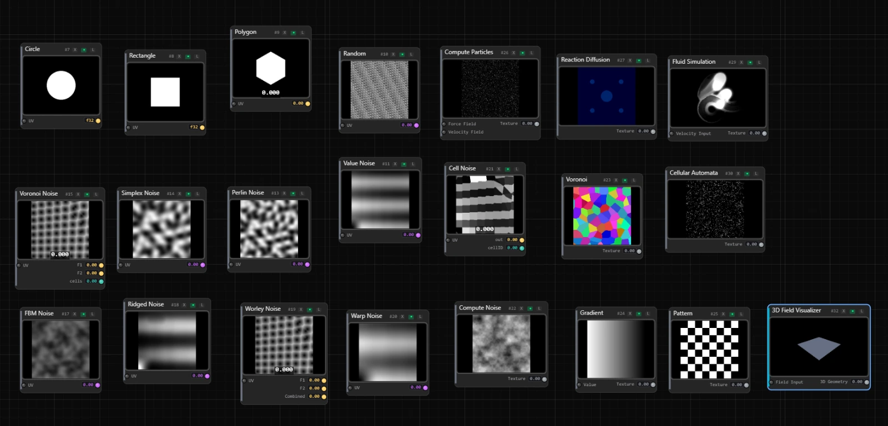

Generator nodes create procedural content: gradients, shapes, and noise. The category contains both fragment nodes and compute nodes.

> Basic patterns (checkerboard, stripes) and the common gradients (linear, radial, angular) are provided by the **Pattern** and **Gradient** compute nodes below.

### Gradients & Ramps

#### Conic Gradient
Generates a conic gradient with angular range control.

- **Category**: Generators
- **Inputs**:
  - `UV` - Texture coordinates
- **Outputs**:
  - `Value` - Gradient value (0-1)
- **Parameters**:
  - `centerX` (float, default: 0.5) - Center X position
  - `centerY` (float, default: 0.5) - Center Y position
  - `startAngle` (float, default: 0.0) - Starting angle in radians
  - `endAngle` (float, default: 6.283) - Ending angle in radians (2π = full circle)
  - `smoothness` (float, default: 0.0) - Edge smoothing amount
- **Description**: Creates a gradient that sweeps between specified start and end angles with smooth transitions.

#### Color Ramp
Maps values to colors using a gradient with control points.

- **Category**: Generators
- **Inputs**:
  - `Value` - Input value to map (0-1)
- **Outputs**:
  - `Color` - Resulting color
- **Parameters**:
  - `stops` (colorstops) - Color gradient stops with positions
  - `mode` (select: Linear/Step/Smooth, default: Linear) - Interpolation mode
- **Description**: Converts scalar values into colors by interpolating through a user-defined color gradient with multiple control points.

#### Gradient (Compute)
Generates linear, radial, angular, and diamond gradients as a texture.

- **Category**: Generators
- **Inputs**: None
- **Outputs**:
  - `Texture` - Gradient texture
- **Parameters**:
  - `type` (select: Linear/Radial/Angular/Diamond, default: Linear) - Gradient shape
  - `angle` (float, default: 0.0, range: 0-360) - Gradient rotation (Linear)
  - `centerX` / `centerY` (float, default: 0.5) - Center position
  - `radius` (float, default: 0.5, range: 0-2) - Radius (Radial)
  - `repeat` (int, default: 1, range: 1-20) - Number of repetitions
  - `reverse` (boolean, default: false) - Reverse gradient direction
  - `colorMode` (select: Grayscale/Rainbow/Gradient, default: Grayscale) - Coloring mode
  - `saturation` (float, default: 0.8) / `brightness` (float, default: 1.0) - Rainbow mode controls
  - `colorStops` (colorstops) - Custom color stops (Gradient mode)
  - `interpolation` (select: Linear/Step/Smooth, default: Linear) - Stop interpolation
- **Description**: The one-stop gradient generator. Replaces the former Linear/Radial/Angular Gradient fragment nodes, with a visual color-stop editor.

### Shape Generators

#### Circle
Generates a circular shape or distance field.

- **Category**: Generators
- **Inputs**:
  - `UV` - Texture coordinates
- **Outputs**:
  - `out` (f32) - Shape value (0 inside, 1 outside)
- **Parameters**:
  - `Center X` (float, default: 0.5) - Circle center X
  - `Center Y` (float, default: 0.5) - Circle center Y
  - `Radius` (float, default: 0.25) - Circle radius
  - `Smoothness` (float, default: 0.01) - Edge softness
  - `Invert` (bool, default: false) - Invert inside/outside
- **Description**: Creates a circular shape with smooth edges, can be used as a mask or distance field.

#### Rectangle
Generates a rectangular shape.

- **Category**: Generators
- **Inputs**:
  - `UV` - Texture coordinates
- **Outputs**:
  - `out` (f32) - Shape value (0 inside, 1 outside)
- **Parameters**:
  - `Center X` (float, default: 0.5) - Rectangle center X
  - `Center Y` (float, default: 0.5) - Rectangle center Y
  - `Width` (float, default: 0.5) - Rectangle width
  - `Height` (float, default: 0.5) - Rectangle height
  - `Roundness` (float, default: 0.0) - Corner rounding amount
  - `Smoothness` (float, default: 0.01) - Edge softness
  - `Invert` (bool, default: false) - Invert inside/outside
- **Description**: Creates a rectangular shape with optional rounded corners and smooth edges.

#### Polygon
Generates a regular polygon shape.

- **Category**: Generators
- **Inputs**:
  - `UV` - Texture coordinates
- **Outputs**:
  - `out` (f32) - Shape value (0 inside, 1 outside)
- **Parameters**:
  - `Center X` (float, default: 0.5) - Polygon center X
  - `Center Y` (float, default: 0.5) - Polygon center Y
  - `Sides` (int, default: 6) - Number of sides
  - `Radius` (float, default: 0.25) - Polygon radius
  - `Rotation` (float, default: 0.0) - Rotation angle
  - `Smoothness` (float, default: 0.01) - Edge softness
  - `Invert` (bool, default: false) - Invert inside/outside
- **Description**: Creates regular polygons (triangle, hexagon, etc.) with adjustable sides, rotation, and smooth edges.

#### Pattern (Compute)
Generates tiled procedural patterns as a texture.

- **Category**: Generators
- **Inputs**: None
- **Outputs**:
  - `Texture` - Pattern texture
- **Parameters**:
  - `type` (select: Checkerboard/Stripes/Dots/Grid/Hexagon/Brick, default: Checkerboard) - Pattern type
  - `scaleX` / `scaleY` (float, default: 8.0, range: 0.1-100) - Tile counts
  - `rotation` (float, default: 0.0, range: 0-360) - Pattern rotation
  - `thickness` (float, default: 0.5, range: 0-1) - Element thickness/ratio
  - `smoothness` (float, default: 0.01, range: 0-0.5) - Edge antialiasing
- **Description**: The one-stop tiling pattern generator. Replaces the former Checker and Stripe fragment nodes and adds dots, grid, hexagon, and brick layouts.

### Noise Functions

#### Random
Generates pseudo-random values.

- **Category**: Generators
- **Inputs**:
  - `UV` - Texture coordinates
- **Outputs**:
  - `out` (vec3) - Random value
- **Parameters**:
  - `Seed` (float, default: 1.0) - Random seed value
  - `Scale` (float, default: 1.0) - Scale of randomness
- **Description**: Generates a spatial pseudo-random field based on UV coordinates, useful for adding randomness to patterns. For a time-driven random number, use the **Random Value** input node instead.

#### Value Noise
Generates smooth value noise.

- **Category**: Generators
- **Inputs**:
  - `UV` - Texture coordinates
- **Outputs**:
  - `out` (vec3) - Noise value
- **Parameters**:
  - `Scale` (float, default: 5.0) - Noise frequency
  - `Amplitude` (float, default: 1.0) - Noise intensity
  - `Offset` (float, default: 0.0) - Value offset
  - `Power` (float, default: 1.0) - Power curve adjustment
- **Description**: Simple interpolated noise between random values at grid points.

#### Perlin Noise
Generates classic Perlin gradient noise.

- **Category**: Generators
- **Inputs**:
  - `UV` - Texture coordinates
- **Outputs**:
  - `out` (vec3) - Noise value
- **Parameters**:
  - `Scale` (float, default: 5.0) - Noise frequency
  - `Amplitude` (float, default: 1.0) - Noise intensity
  - `Offset` (float, default: 0.0) - Value offset
- **Description**: Classic Perlin noise algorithm producing smooth, natural-looking noise patterns.

#### Simplex Noise
Generates Simplex noise with optional variations.

- **Category**: Generators
- **Inputs**:
  - `UV` - Texture coordinates
- **Outputs**:
  - `out` (vec3) - Noise value
- **Parameters**:
  - `Scale` (float, default: 4.0) - Noise frequency
  - `Amplitude` (float, default: 1.0) - Noise intensity
  - `Offset` (float, default: 0.0) - Value offset
  - `Ridge Mode` (bool, default: false) - Enable ridge noise
  - `Turbulence` (bool, default: false) - Enable turbulence mode
- **Description**: Modern Simplex noise with better performance than Perlin, includes ridge and turbulence variations.

#### FBM Noise
Generates Fractional Brownian Motion noise.

- **Category**: Generators
- **Inputs**:
  - `UV` - Texture coordinates
- **Outputs**:
  - `out` (vec3) - Noise value
- **Parameters**:
  - `Scale` (float, default: 3.0) - Base frequency
  - `Octaves` (int, default: 4) - Number of noise layers
  - `Persistence` (float, default: 0.5) - Amplitude decay per octave
  - `Lacunarity` (float, default: 2.0) - Frequency increase per octave
  - `Amplitude` (float, default: 1.0) - Overall intensity
  - `Offset` (float, default: 0.0) - Value offset
  - `Gain` (float, default: 0.5) - Octave gain factor
  - `Warp` (float, default: 0.0) - Domain warping amount
- **Description**: Layered noise with multiple octaves creating complex, natural-looking patterns like clouds or terrain.

#### Voronoi Noise
Generates cellular Voronoi patterns.

- **Category**: Generators
- **Inputs**:
  - `UV` - Texture coordinates
- **Outputs**:
  - `F1` (f32) - Distance to closest cell
  - `F2` (f32) - Distance to second closest cell
  - `cells` (vec2) - Cell center coordinates
- **Parameters**:
  - `Scale` (float, default: 8.0) - Cell density
  - `Randomness` (float, default: 1.0) - Cell point randomization
  - `Distance Type` (float, default: 2.0) - Minkowski distance parameter
  - `Smoothness` (float, default: 0.0) - Cell edge smoothing
  - `Cell Type` (int, default: 0) - Cell pattern variation
  - `Output Type` (int, default: 0) - Output mode selection
- **Description**: Creates cellular patterns based on distances to randomly distributed points, useful for tiles, cells, and stone textures.

#### Ridged Noise
Generates ridged multi-fractal noise.

- **Category**: Generators
- **Inputs**:
  - `UV` - Texture coordinates
- **Outputs**:
  - `out` (vec3) - Noise value
- **Parameters**:
  - `Scale` (float, default: 4.0) - Base frequency
  - `Octaves` (int, default: 6) - Number of layers
  - `Lacunarity` (float, default: 2.0) - Frequency multiplier
  - `Gain` (float, default: 0.5) - Amplitude multiplier
  - `Amplitude` (float, default: 1.0) - Overall intensity
  - `Offset` (float, default: 1.0) - Ridge offset
  - `Threshold` (float, default: 0.0) - Ridge threshold
- **Description**: Specialized noise creating sharp ridges and valleys, ideal for mountainous terrain.

#### Warp Noise
Generates domain-warped noise.

- **Category**: Generators
- **Inputs**:
  - `UV` - Texture coordinates
- **Outputs**:
  - `out` (vec3) - Warped noise value
- **Parameters**:
  - `Scale` (float, default: 3.0) - Base noise frequency
  - `Warp Scale` (float, default: 2.0) - Warp noise frequency
  - `Warp Strength` (float, default: 0.1) - Warping intensity
  - `Octaves` (int, default: 3) - Number of noise layers
  - `Amplitude` (float, default: 1.0) - Overall intensity
- **Description**: Applies domain warping to create swirling, organic noise patterns.

#### Worley Noise
Generates Worley (cellular) noise.

- **Category**: Generators
- **Inputs**:
  - `UV` - Texture coordinates
- **Outputs**:
  - `F1` (f32) - Distance to nearest point
  - `F2` (f32) - Distance to second nearest point
  - `Combined` (f32) - Combined distance metric
- **Parameters**:
  - `Scale` (float, default: 8.0) - Point density
  - `Jitter` (float, default: 1.0) - Point randomization
  - `Distance Metric` (select: euclidean/manhattan/chebyshev/minkowski, default: euclidean) - Distance calculation method
  - `Minkowski P` (float, default: 2.0) - Minkowski distance parameter
- **Description**: Creates cellular patterns based on distances to random points using various distance metrics.

#### Cell Noise
Generates simple cell-based patterns.

- **Category**: Generators
- **Inputs**:
  - `UV` - Texture coordinates
- **Outputs**:
  - `out` (f32) - Cell pattern value
  - `cellID` (vec2) - Cell identifier coordinates
- **Parameters**:
  - `Scale` (float, default: 8.0) - Cell density
  - `Randomness` (float, default: 1.0) - Cell value variation
  - `Smooth` (bool, default: false) - Enable smooth interpolation
- **Description**: Simple cellular pattern generator with optional smoothing and cell identification output.

#### Compute Noise (Compute)
Generates animated procedural noise as a texture.

- **Category**: Generators
- **Inputs**: None
- **Outputs**:
  - `Texture` - Noise texture
- **Parameters**:
  - `scale` (float, default: 8.0, range: 0.1-50) - Noise frequency
  - `octaves` (int, default: 5, range: 1-8) - Detail layers
  - `speed` (float, default: 0.1, range: 0-2) - Animation speed
  - `seed` (float, default: 0.0, range: 0-100) - Offsets the noise field so each value yields a different pattern
  - `colorize` (boolean, default: true) - Color output
  - `resolution` (select: 256/512/1024, default: 512) - Output texture size
- **Description**: Fractal Brownian Motion noise computed in a compute pass, ideal for animated backgrounds and organic textures.

#### Voronoi (Compute)
Generates Voronoi diagrams and Worley noise as a texture.

- **Category**: Generators
- **Inputs**: None
- **Outputs**:
  - `Texture` - Voronoi texture
- **Parameters**:
  - `mode` (select: Cells/Distance/Borders/Worley, default: Cells) - Output mode
  - `scale` (float, default: 8.0, range: 0.1-50) - Cell density
  - `pointCount` (int, default: 16, range: 4-64) - Number of feature points
  - `distanceMetric` (select: Euclidean/Manhattan/Chebyshev/Minkowski, default: Euclidean) - Distance calculation
  - `seed` (float, default: 0.0) - Randomization seed
  - `animate` (boolean, default: true) - Animate the points
  - `speed` (float, default: 0.1, range: 0-2) - Animation speed
- **Description**: GPU-computed cellular patterns with animated feature points.

---

## Transform Nodes

Transform nodes manipulate UV coordinates for texture mapping, distortion, and coordinate space conversions.

**Context-aware texture pin**: Most transform nodes have two input pins — `UV (opt.)` and `Texture`. When the `Texture` pin is connected to a compute node or Texture 2D node, the transform is applied to the sampling UV and the node outputs a vec4 color directly. When no texture is connected, the node behaves as a pure UV modifier (vec2 output) that feeds into downstream texture samplers. Use the **Transform** compute node instead when you need to transform a compute texture without any downstream texture sampler.

> Kaleidoscope is now a compute node — see [Effect Nodes](#effect-nodes).

### Basic Transforms

#### Transform 2D

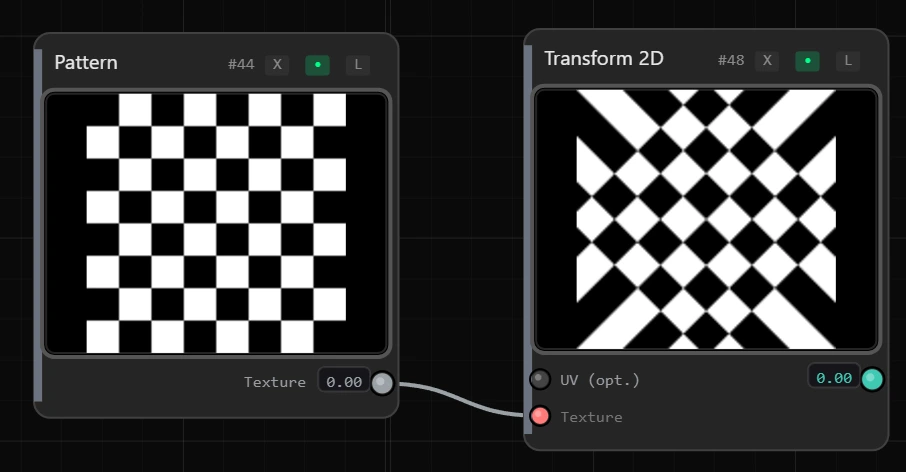
Applies combined transformation to UV coordinates.

- **Category**: Transform
- **Inputs**:
  - `UV (opt.)` - Input coordinates
  - `Texture` - Optional texture to sample with the transformed UV
- **Outputs**:
  - `out` (vec2, or vec4 when a texture is connected) - Transformed coordinates or sampled color
- **Parameters**:
  - `Translate X` (float, default: 0.0) - Horizontal offset
  - `Translate Y` (float, default: 0.0) - Vertical offset
  - `Scale X` (float, default: 1.0) - Horizontal scale
  - `Scale Y` (float, default: 1.0) - Vertical scale
  - `Rotation` (float, default: 0.0) - Rotation angle in degrees
  - `Center X` (float, default: 0.5) - Transform center X
  - `Center Y` (float, default: 0.5) - Transform center Y
- **Description**: Combines translation, rotation, and scaling transformations around a specified center point.

#### Scale 2D

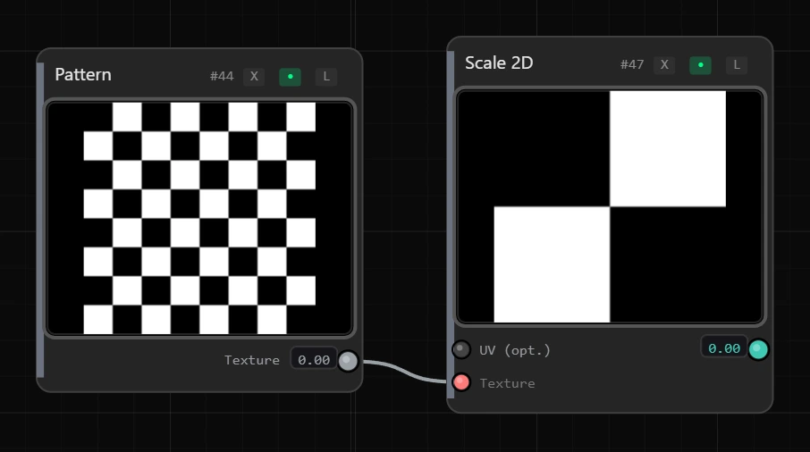
Scales UV coordinates.

- **Category**: Transform
- **Inputs**:
  - `UV (opt.)` - Input coordinates
  - `Texture` - Optional texture to sample with the transformed UV
- **Outputs**:
  - `out` (vec2, or vec4 when a texture is connected) - Scaled coordinates or sampled color
- **Parameters**:
  - `Scale X` (float, default: 1.0) - Horizontal scale factor
  - `Scale Y` (float, default: 1.0) - Vertical scale factor
  - `Center X` (float, default: 0.5) - Scale center X
  - `Center Y` (float, default: 0.5) - Scale center Y
- **Description**: Scales UV coordinates around a center point. Values > 1 zoom in, values < 1 zoom out.

#### Rotate 2D

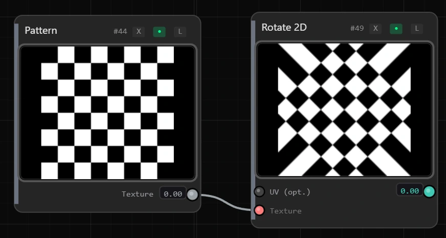
Rotates UV coordinates.

- **Category**: Transform
- **Inputs**:
  - `UV (opt.)` - Input coordinates
  - `Texture` - Optional texture to sample with the transformed UV
- **Outputs**:
  - `out` (vec2, or vec4 when a texture is connected) - Rotated coordinates or sampled color
- **Parameters**:
  - `Rotation` (float, default: 0.0) - Rotation angle in degrees
  - `Center X` (float, default: 0.5) - Rotation center X
  - `Center Y` (float, default: 0.5) - Rotation center Y
- **Description**: Rotates UV coordinates around a center point.

#### Tile and Offset

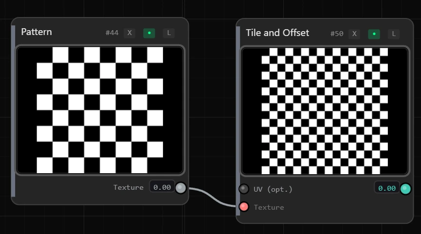
Applies tiling and offset to UV coordinates.

- **Category**: Transform
- **Inputs**:
  - `UV (opt.)` - Input coordinates
  - `Texture` - Optional texture to sample with the transformed UV
- **Outputs**:
  - `out` (vec2, or vec4 when a texture is connected) - Tiled and offset coordinates or sampled color
- **Parameters**:
  - `Tiling X` (float, default: 1.0) - Horizontal repeat count
  - `Tiling Y` (float, default: 1.0) - Vertical repeat count
  - `Offset X` (float, default: 0.0) - Horizontal offset
  - `Offset Y` (float, default: 0.0) - Vertical offset
- **Description**: Classic UV tiling and offset operation. Tiling creates repeating patterns, offset shifts them.

#### Flip 2D

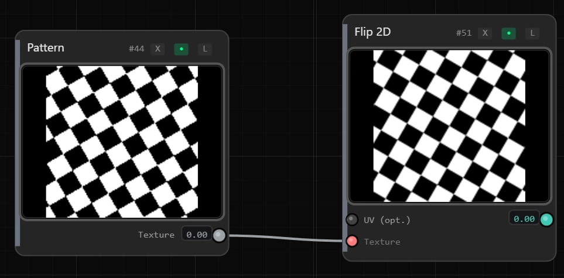
Flips UV coordinates horizontally and/or vertically.

- **Category**: Transform
- **Inputs**:
  - `UV (opt.)` - Input coordinates
  - `Texture` - Optional texture to sample with the transformed UV
- **Outputs**:
  - `out` (vec2, or vec4 when a texture is connected) - Flipped coordinates or sampled color
- **Parameters**:
  - `Flip X` (bool, default: false) - Flip horizontally
  - `Flip Y` (bool, default: false) - Flip vertically
- **Description**: Mirrors UV coordinates along horizontal and/or vertical axes.

### Coordinate Conversion

#### UV to Color

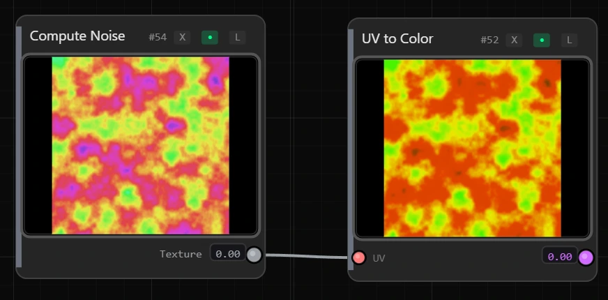
Converts UV coordinates to a color for visualization.

- **Category**: Transform
- **Inputs**:
  - `UV` - Input coordinates
- **Outputs**:
  - `out` (vec3) - Color representation of UV
- **Description**: Visualizes UV coordinates as colors (U=Red, V=Green). Useful for debugging UV layouts.

#### Polar Coordinates

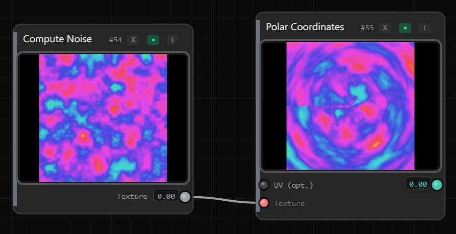
Converts Cartesian coordinates to polar coordinates.

- **Category**: Transform
- **Inputs**:
  - `UV (opt.)` - Input Cartesian coordinates
  - `Texture` - Optional texture to sample with the converted UV
- **Outputs**:
  - `out` (vec2, or vec4 when a texture is connected) - Polar coordinates (angle, radius) or sampled color
- **Parameters**:
  - `Center X` (float, default: 0.5) - Polar center X
  - `Center Y` (float, default: 0.5) - Polar center Y
  - `Radial Scale` (float, default: 1.0) - Radius scaling
  - `Angular Scale` (float, default: 1.0) - Angle scaling
- **Description**: Converts to polar coordinate system. Creates radial patterns and circular warping effects.

### Distortion Effects

#### Spherize

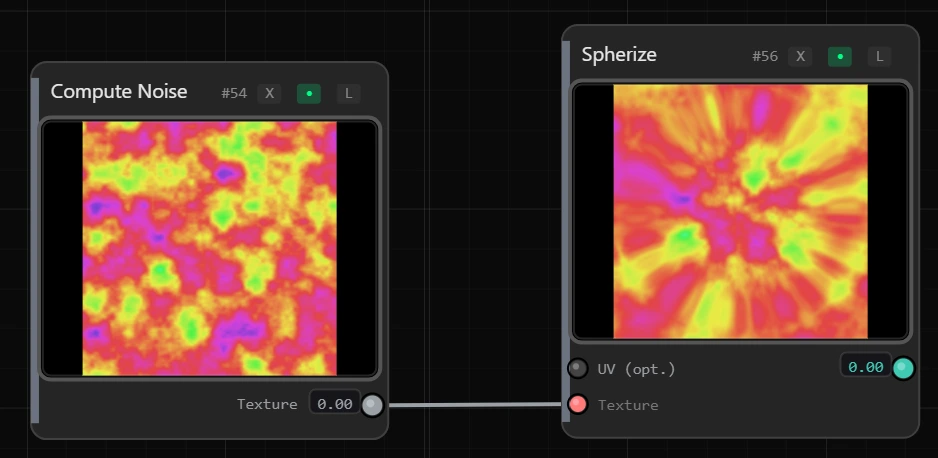
Applies spherical distortion to UV coordinates.

- **Category**: Transform
- **Inputs**:
  - `UV (opt.)` - Input coordinates
  - `Texture` - Optional texture to sample with the distorted UV
- **Outputs**:
  - `out` (vec2, or vec4 when a texture is connected) - Spherized coordinates or sampled color
- **Parameters**:
  - `Center X` (float, default: 0.5) - Effect center X
  - `Center Y` (float, default: 0.5) - Effect center Y
  - `Strength` (float, default: 0.5) - Distortion strength
  - `Radius` (float, default: 0.5) - Effect radius
- **Description**: Creates a spherical bulge or pinch distortion effect.

#### Twirl

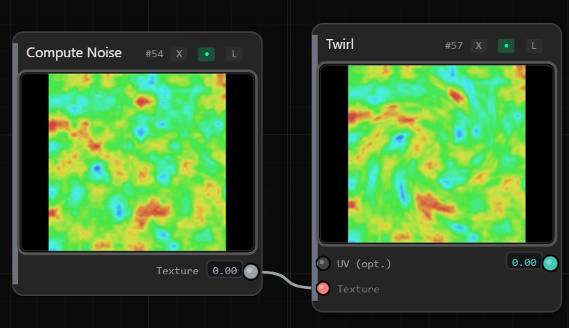
Applies twisting/swirling distortion to UV coordinates.

- **Category**: Transform
- **Inputs**:
  - `UV (opt.)` - Input coordinates
  - `Texture` - Optional texture to sample with the distorted UV
- **Outputs**:
  - `out` (vec2, or vec4 when a texture is connected) - Twirled coordinates or sampled color
- **Parameters**:
  - `Center X` (float, default: 0.5) - Twirl center X
  - `Center Y` (float, default: 0.5) - Twirl center Y
  - `Strength` (float, default: 1.0) - Rotation intensity
  - `Radius` (float, default: 0.5) - Effect radius
- **Description**: Creates a spiral/vortex distortion effect, rotating UVs around a center point.

#### Displacement

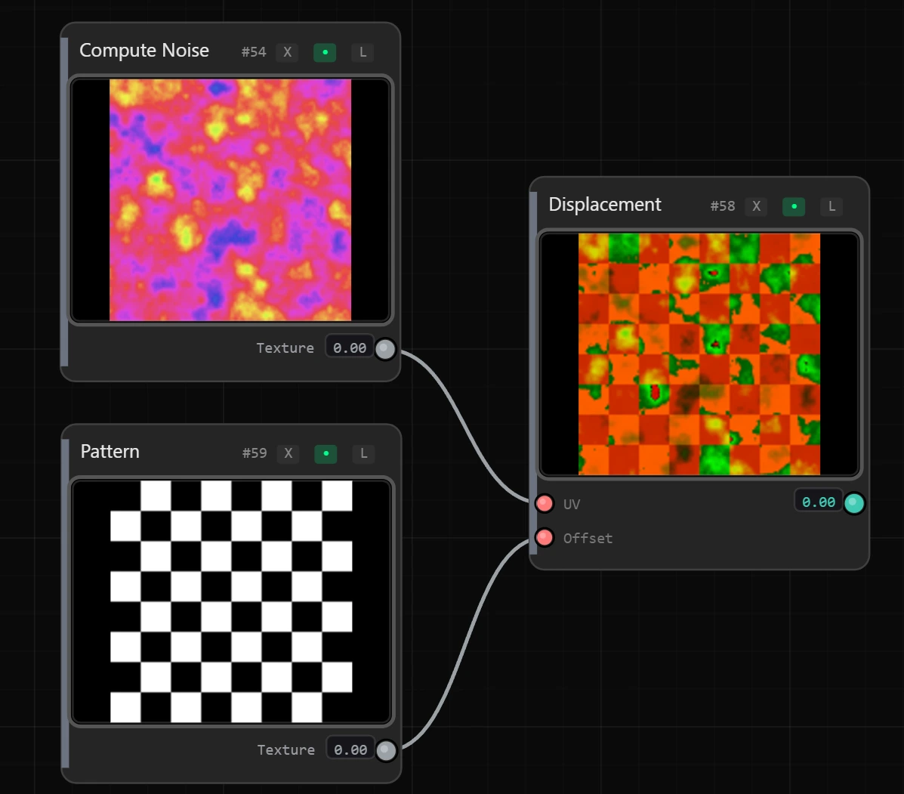
Displaces UV coordinates based on an offset field.

- **Category**: Transform
- **Inputs**:
  - `UV` - Base texture coordinates
  - `Offset` - Displacement amount/direction
- **Outputs**:
  - `out` (vec2) - Displaced UV coordinates
- **Parameters**:
  - `Strength` (float, default: 0.2) - Displacement intensity
  - `Center Input` (boolean, default: true) - Center the offset range (-0.5 to 0.5)
  - `Wrap UV` (boolean, default: false) - Wrap coordinates at boundaries
- **Description**: Distorts UV coordinates based on an input field, useful for creating refraction, ripples, or warping effects.

---

## Modifier Nodes

Modifier nodes adjust and process existing colors and textures. The category contains fragment color nodes and compute image-processing nodes.

> Simple brightness/contrast/saturation adjustments and HSV conversions are provided by the **Color Adjust** and **HSV** compute nodes.

### Fragment Color Nodes

#### To Grayscale
Converts a color to grayscale.

- **Category**: Modifiers
- **Inputs**:
  - `Color` - Input color (vec3)
- **Outputs**:
  - `out` (f32) - Grayscale value
- **Parameters**:
  - `Method` (select: luminance/average/lightness, default: luminance) - Conversion method
- **Description**: Converts RGB color to a single grayscale value using various methods. Luminance uses perceptual weighting (0.299R + 0.587G + 0.114B).

#### Invert Color

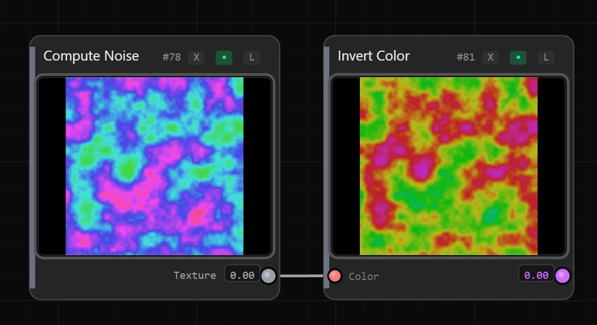
Inverts a color.

- **Category**: Modifiers
- **Inputs**:
  - `Color` - Input color (vec3)
- **Outputs**:
  - `out` (vec3) - Inverted color
- **Description**: Inverts each color channel by computing (1 - color). Creates a negative image effect.

#### Color Mix
Blends two colors using various blend modes.

- **Category**: Modifiers
- **Inputs**:
  - `Base` - Base color
  - `Blend` - Blend color
  - `Factor` - Blend factor (0-1)
- **Outputs**:
  - `out` (vec3) - Mixed color
- **Parameters**:
  - `Mode` (select, default: mix) - Blend mode: mix, multiply, screen, overlay, add, subtract, divide, difference, darken, lighten
- **Description**: Combines two colors using various blend modes similar to image editing software.

### Compute Image Processing

#### Compute Blur (Compute)

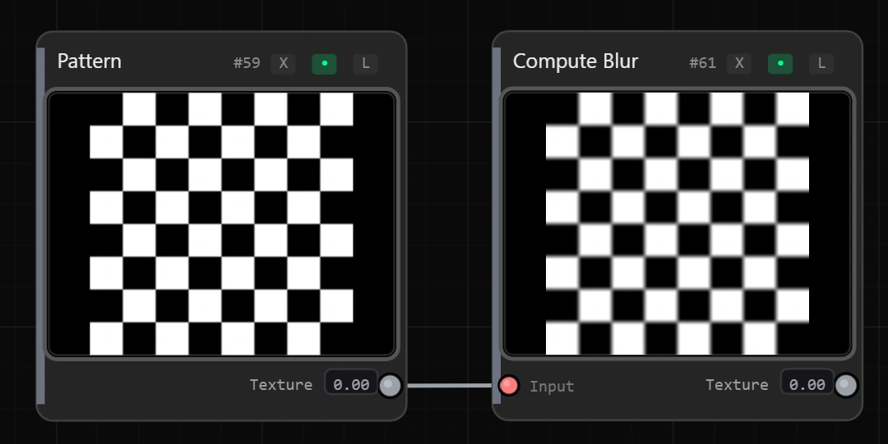
Applies Gaussian blur to an input texture.

- **Category**: Modifiers
- **Inputs**:
  - `Input` - Texture to blur
- **Outputs**:
  - `Texture` - Blurred texture
- **Parameters**:
  - `radius` (float, default: 5.0, range: 0-20) - Blur radius
  - `quality` (select: Low/Medium/High, default: Medium) - Sample quality
  - `direction` (select: Both/Horizontal/Vertical, default: Both) - Blur direction
- **Description**: Fast Gaussian blur for glow, depth-of-field, and softening effects.

#### Compute Convolution (Compute)

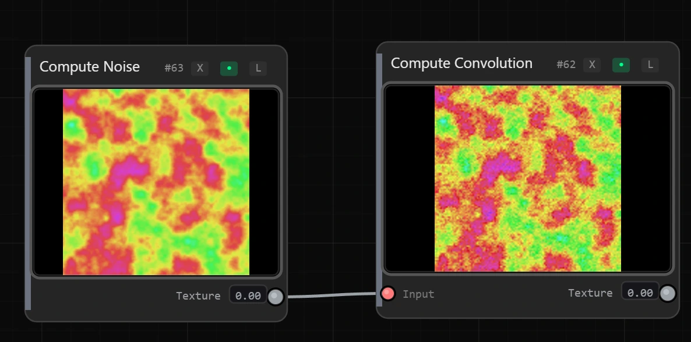
Applies a convolution kernel to an input texture.

- **Category**: Modifiers
- **Inputs**:
  - `Input` - Texture to filter
- **Outputs**:
  - `Texture` - Filtered texture
- **Parameters**:
  - `kernel` (select: Sharpen/Edge Detect/Emboss/Custom, default: Sharpen) - Kernel preset
  - `strength` (float, default: 1.0, range: 0-2) - Effect strength
- **Description**: Classic image convolution filtering (sharpen, edge detect, emboss).

#### Threshold (Compute)

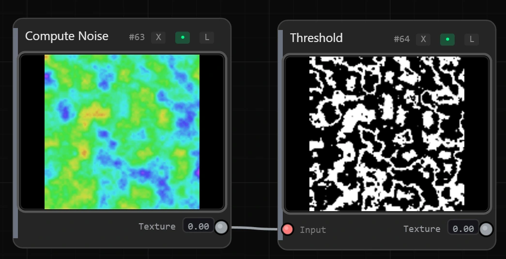
Thresholds an input texture.

- **Category**: Modifiers
- **Inputs**:
  - `Input` - Texture to threshold
- **Outputs**:
  - `Texture` - Thresholded texture
- **Parameters**:
  - `mode` (select: Binary/Range/Adaptive, default: Binary) - Threshold mode
  - `threshold` (float, default: 0.5) - Binary threshold
  - `thresholdMin` / `thresholdMax` (float, defaults: 0.3 / 0.7) - Range mode bounds
  - `outputLow` / `outputHigh` (float, defaults: 0.0 / 1.0) - Output values
- **Description**: Binary, range, and adaptive thresholding operations.

#### Color Adjust (Compute)

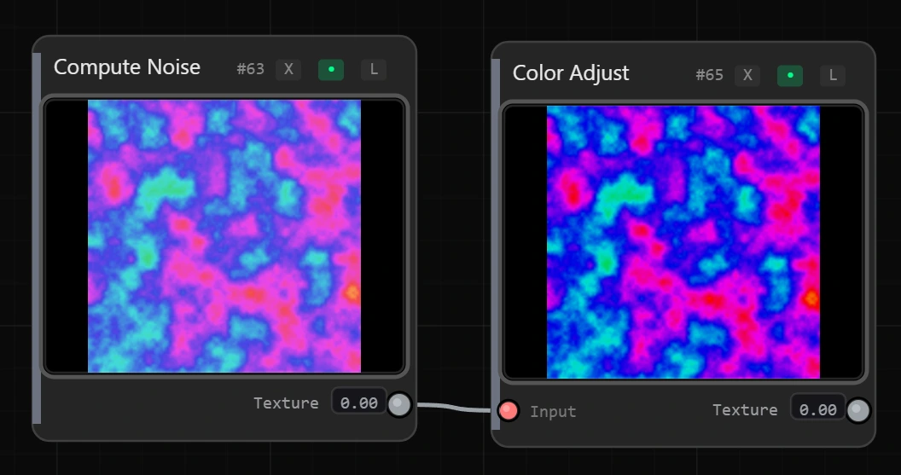
Full color grading for a texture.

- **Category**: Modifiers
- **Inputs**:
  - `Input` - Texture to adjust
- **Outputs**:
  - `Texture` - Adjusted texture
- **Parameters**:
  - `brightness` (float, default: 0.0, range: -1 to 1)
  - `contrast` (float, default: 1.0, range: 0-3)
  - `saturation` (float, default: 1.0, range: 0-3)
  - `hue` (float, default: 0.0, range: -180 to 180) - Hue shift in degrees
  - `gamma` (float, default: 1.0, range: 0.1-3)
  - `exposure` (float, default: 0.0, range: -3 to 3)
- **Description**: One node for brightness, contrast, saturation, hue, gamma, and exposure. Replaces the former Brightness/Contrast/Saturate Color fragment nodes.

#### Edge Detect (Compute)
Detects edges in an input texture.

- **Category**: Modifiers
- **Inputs**:
  - `Input` - Texture to analyze
- **Outputs**:
  - `Texture` - Edge texture
- **Parameters**:
  - `method` (select: Sobel/Scharr/Prewitt/Roberts, default: Sobel) - Gradient operator
  - `threshold` (float, default: 0.1) - Edge threshold
  - `strength` (float, default: 1.0, range: 0-5) - Edge intensity
  - `invertEdges` (boolean, default: false) - Invert output
- **Description**: Edge detection using various gradient operators.

#### Morphology (Compute)

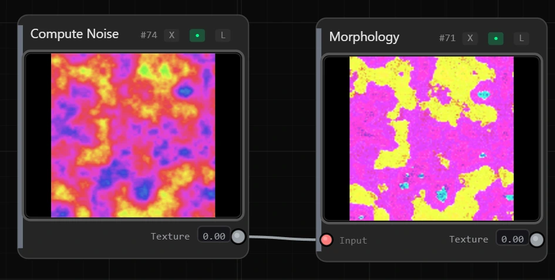
Morphological operations on a texture.

- **Category**: Modifiers
- **Inputs**:
  - `Input` - Texture to process
- **Outputs**:
  - `Texture` - Processed texture
- **Parameters**:
  - `operation` (select: Dilate/Erode/Open/Close, default: Dilate) - Operation
  - `kernelSize` (select: 3x3/5x5/7x7, default: 3x3) - Kernel size
  - `iterations` (int, default: 1, range: 1-10) - Number of passes
  - `strength` (float, default: 1.0, range: 0-1) - Blend with original
- **Description**: Dilate, erode, open, and close operations for growing/shrinking bright regions.

#### Histogram (Compute)

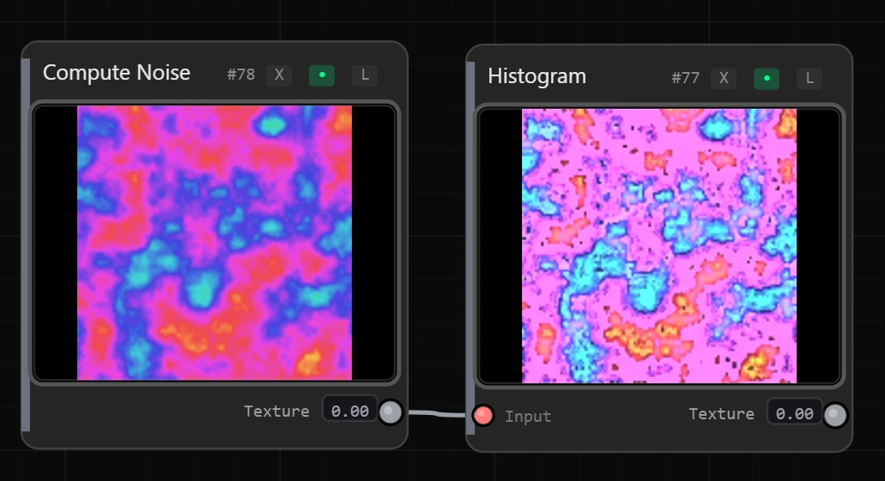
Histogram-based analysis and equalization.

- **Category**: Modifiers
- **Inputs**:
  - `Input` - Texture to analyze
- **Outputs**:
  - `Texture` - Processed texture
- **Parameters**:
  - `operation` (select: Equalize/Normalize/Stretch/Visualize, default: Equalize) - Operation
  - `channel` (select: RGB/R/G/B/Luminance, default: Luminance) - Channel to analyze
  - `bins` (int, default: 16, range: 8-32) - Histogram bins
  - `strength` (float, default: 1.0, range: 0-1) - Effect strength
- **Description**: Histogram equalization, normalization, contrast stretching, and visualization.

#### Luminance (Compute)

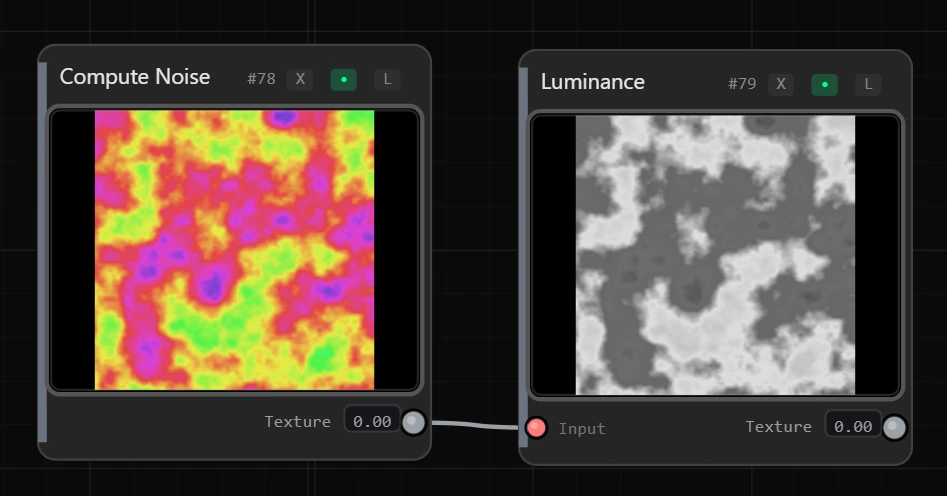
Luminance extraction and operations.

- **Category**: Modifiers
- **Inputs**:
  - `Input` - Texture to process
- **Outputs**:
  - `Texture` - Processed texture
- **Parameters**:
  - `method` (select: Rec709/Rec601/Average/Max/Min, default: Rec709) - Luminance formula
  - `outputMode` (select: Grayscale/Preserve Color/Isoluminant, default: Grayscale) - Output mode
  - `threshold` (float, default: 0.5) - Threshold for applicable modes
- **Description**: Extracts luminance using standard formulas with several output modes.

---

## Effect Nodes

Effect nodes are compute nodes that create visual effects — warps, mirrors, glitches, and feedback trails.

#### Compute Feedback (Compute)

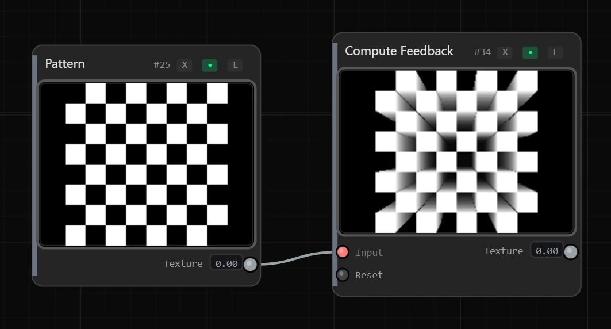
Creates feedback loops for trails and recursive patterns.

- **Category**: Effects
- **Inputs**:
  - `Input` - Texture to feed back
  - `Reset` (f32, control pin) - A rising edge (e.g. from a Trigger node) clears the accumulated trail
- **Outputs**:
  - `Texture` - Feedback texture
- **Parameters**:
  - `decay` (float, default: 0.95, range: 0-1) - Trail persistence
  - `scale` (float, default: 1.01, range: 0.9-1.1) - Zoom per frame
  - `rotation` (float, default: 0.0, range: -180 to 180) - Rotation per frame
  - `offsetX` / `offsetY` (float, default: 0.0, range: -0.1 to 0.1) - Drift per frame
  - `Reset Feedback` (button) - Manually clear the accumulated trail
- **Description**: Blends the previous frame back into the current one with a transformation, creating motion trails, tunnels, and recursive patterns. Uses ping-pong buffers. The **Reset** pin performs the same clear as the button, driven by a signal — wire a Trigger to reset on a beat or event.

#### Warp (Compute)

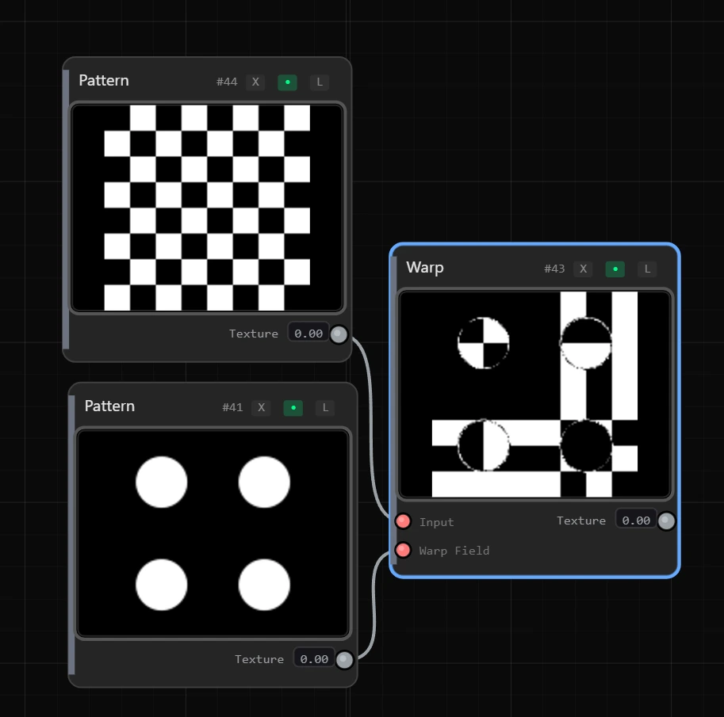
UV distortion and displacement effects.

- **Category**: Effects
- **Inputs**:
  - `Input` - Texture to warp
  - `Warp Field` - Optional texture that drives the displacement
- **Outputs**:
  - `Texture` - Warped texture
- **Parameters**:
  - `mode` (select: Displace/Twist/Bulge/Pinch/Wave, default: Displace) - Warp type
  - `strength` (float, default: 0.5, range: 0-5) - Effect strength
  - `centerX` / `centerY` (float, default: 0.5) - Effect center
  - `radius` (float, default: 0.5, range: 0-2) - Effect radius
  - `frequency` (float, default: 4.0, range: 0.1-20) - Wave frequency
  - `phase` (float, default: 0.0, range: 0-360) - Wave phase
- **Description**: Distorts a texture with several warp modes; the Warp Field input allows another texture (e.g. noise) to drive the displacement.

#### Kaleidoscope (Compute)

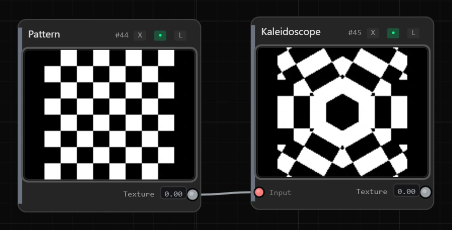
Creates kaleidoscope mirror effects.

- **Category**: Effects
- **Inputs**:
  - `Input` - Texture to mirror
- **Outputs**:
  - `Texture` - Kaleidoscope texture
- **Parameters**:
  - `segments` (int, default: 6, range: 2-24) - Number of mirror segments
  - `rotation` (float, default: 0.0, range: 0-360) - Rotation offset
  - `centerX` / `centerY` (float, default: 0.5) - Mirror center
  - `scale` (float, default: 1.0, range: 0.1-5) - Zoom level
  - `animate` (boolean, default: false) - Auto-rotate
  - `speed` (float, default: 0.5, range: 0-5) - Rotation speed when animated
- **Description**: Creates repeating mirror symmetry patterns like a kaleidoscope. Replaces the former fragment Kaleidoscope transform node, adding animation support.

#### Glitch (Compute)

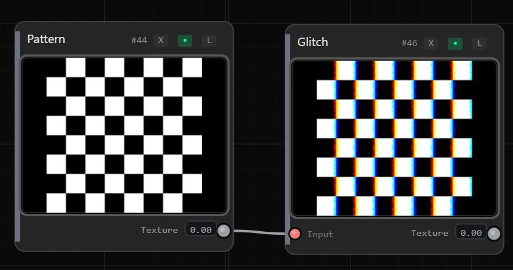
Digital glitch and artifact effects.

- **Category**: Effects
- **Inputs**:
  - `Input` - Texture to glitch
- **Outputs**:
  - `Texture` - Glitched texture
- **Parameters**:
  - `type` (select: RGB Shift/Block/Scanline/Pixelate/Corrupt, default: RGB Shift) - Glitch style
  - `intensity` (float, default: 0.5, range: 0-1) - Effect intensity
  - `frequency` (float, default: 0.5, range: 0-1) - How often glitches occur
  - `blockSize` (float, default: 0.05, range: 0.01-0.5) - Block/pixel size
  - `seed` (float, default: 0.0) - Randomization seed
- **Description**: Simulates digital corruption: channel shifts, block displacement, scanlines, pixelation.

---

## Simulation Nodes

Simulation nodes are compute nodes that run stateful, physics-based systems on the GPU.

#### Compute Particles (Compute)
GPU particle system with physics.

- **Category**: Simulation
- **Inputs**:
  - `Force Field` - Optional texture providing forces
  - `Velocity Field` - Optional texture providing velocities
- **Outputs**:
  - `Texture` - Rendered particles
- **Parameters**:
  - `particleCount` (int, default: 10000, range: 1000-100000) - Number of particles
  - `speed` (float, default: 1.0, range: 0-5) - Simulation speed
  - `size` (float, default: 2.0, range: 0.5-10) - Particle core radius in pixels
  - `sizeVariation` (float, default: 0.3, range: 0-1) - Random per-particle size spread
  - `lifetime` (float, default: 5.0, range: 1-20) - Particle lifetime in seconds (particles fade in/out and respawn)
  - `color` (color, default: white) - Particle tint; the alpha channel scales overall intensity
  - `depth` (float, default: 0, range: 0-1) - Pseudo-3D look: near particles are bigger, brighter and move faster (parallax)
  - `driftAngle` (float, default: 0, range: -180-180) - Direction of the shared drift, in degrees
  - `driftStrength` (float, default: 0, range: 0-2) - How strongly all particles drift in that direction
  - `scatter` (float, default: 0.5, range: 0-1) - Random per-particle wander amount
  - `turbulence` (float, default: 0, range: 0-2) - Time-varying wobble along each particle's path
  - `glow` (float, default: 0.15, range: 0-1) - Soft halo around each particle
  - `twinkle` (float, default: 0, range: 0-1) - Per-particle brightness flicker
- **Description**: Simulates and renders thousands of particles in real time; force and velocity fields can be driven by other textures. The Force Field input accelerates particles, the Velocity Field sets their initial velocity — both decode the texture's red/green channels as a vector field (mid-gray = zero). Output is opaque over black; wire it into Compute Feedback for motion trails.

#### Reaction Diffusion (Compute)
Gray-Scott reaction-diffusion simulation.

- **Category**: Simulation
- **Inputs**: None
- **Outputs**:
  - `Texture` - Simulation state
- **Parameters**:
  - `pattern` (select: Coral/Spots/Stripes/Waves/Mitosis/Worms/Spirals, default: Coral) - Parameter preset
  - `feedRate` (float, default: 0.0545, range: 0-0.1) - Feed rate
  - `killRate` (float, default: 0.062, range: 0-0.1) - Kill rate
  - `diffusionA` (float, default: 1.0, range: 0.5-2) - Diffusion rate A
  - `diffusionB` (float, default: 0.5, range: 0.1-1) - Diffusion rate B
  - `timestep` (float, default: 1.0, range: 0.01-5) - Simulation speed
  - `resolution` (select: 256/512/1024, default: 512) - Simulation resolution
- **Description**: Organic Turing patterns that continuously evolve. Pattern presets configure the feed/kill rates for classic morphologies.

#### Fluid Simulation (Compute)
Navier-Stokes fluid dynamics (single-pass stable fluids with dye advection).

- **Category**: Simulation
- **Inputs**:
  - `Velocity Input` - Optional texture stirring the fluid (RG channels decode to a [-1,1] force field, mid-gray = no force; its magnitude also injects dye). Leave unconnected to use three built-in orbiting emitters.
- **Outputs**:
  - `Texture` - The visualized fluid (see `colorMode`)
- **Parameters**:
  - `viscosity` (float, default: 0.0001, range: 0-0.01) - Velocity diffusion; higher = thicker, syrupy motion
  - `diffusion` (float, default: 0.0, range: 0-0.1) - How quickly the dye spreads and fades
  - `timestep` (float, default: 0.1, range: 0.01-1) - Simulation speed
  - `iterations` (int, default: 20, range: 1-50) - Pressure-solve strength; higher = stiffer, more incompressible flow
  - `curl` (float, default: 15, range: 0-50) - Vorticity confinement; accentuates small swirls
  - `forceStrength` (float, default: 1, range: 0-5) - How strongly the input (or emitters) stirs the fluid
  - `dyeAmount` (float, default: 1, range: 0-5) - How much dye the injectors emit
  - `colorMode` (select: Dye/Velocity/Vorticity/Pressure, default: Dye) - Visualization mode; a pure display switch that never resets the simulation
  - `reset` (button) - Return the fluid to rest and clear all dye
- **Description**: Real-time smoke/ink-style fluid simulation. Dye mode renders neutral white smoke on black (composable downstream); Velocity maps flow direction to hue; Vorticity and Pressure are diagnostic views of the solver state.

#### Cellular Automata (Compute)
Cellular automata simulation (Game of Life, etc.).

- **Category**: Simulation
- **Inputs**: None
- **Outputs**:
  - `Texture` - Automata state
- **Parameters**:
  - `rule` (select: Conway Life/Seeds/Brian's Brain/Day & Night, default: Conway Life) - Rule set
  - `speed` (float, default: 10.0, range: 1-60) - Generations per second
  - `density` (float, default: 0.3, range: 0-1) - Initial random density
  - `reset` (boolean) - Re-seed the grid
- **Description**: Classic cellular automata with several rule presets.

#### Feedback Field (Compute)
Persistent feedback field for flow and accumulation simulations.

- **Category**: Simulation
- **Inputs**:
  - `Input` - Texture feeding the field
  - `Reset` (f32, control pin) - A rising edge (e.g. from a Trigger node) clears the accumulated field
- **Outputs**:
  - `Texture` - Field state
- **Parameters**:
  - `mode` (select: Flow/Reaction-Diffusion/Accumulate/Swirl, default: Flow) - Field behavior
  - `decay` (float, default: 0.98, range: 0-1) - Field persistence
  - `diffusion` (float, default: 0.1, range: 0-1) - Spatial spreading
  - `feedback` (float, default: 0.5, range: 0-1) - Input contribution
  - `speed` (float, default: 1.0, range: 0-5) - Simulation speed
  - `resolution` (select: 256/512/1024, default: 512) - Field resolution
  - `Reset Field` (button) - Manually clear the accumulated field
- **Description**: A persistent 2D field that accumulates and transforms its input over time. Like Compute Feedback, the **Reset** pin clears the field on a rising edge — wire a Trigger for signal-driven resets.

---

## Utility Nodes

Utility nodes provide data manipulation, logic, custom code, and texture compositing. The category contains both fragment nodes and compute nodes.

### Data Manipulation

#### Expression
Evaluates a custom mathematical expression.

- **Category**: Utility
- **Inputs**:
  - `a` - First input variable
  - `b` - Second input variable
- **Outputs**:
  - `out` (f32) - Expression result
- **Parameters**:
  - `Expression` (expression, default: "a") - Mathematical expression to evaluate
- **Description**: Allows custom mathematical expressions using input variables. Supports standard math operators and functions.

#### Remap
Remaps a value from one range to another.

- **Category**: Utility
- **Inputs**:
  - `Value` - Input value to remap
- **Outputs**:
  - `out` (f32) - Remapped value
- **Parameters**:
  - `In Min` (float, default: 0.0) - Input range minimum
  - `In Max` (float, default: 1.0) - Input range maximum
  - `Out Min` (float, default: 0.0) - Output range minimum
  - `Out Max` (float, default: 1.0) - Output range maximum
  - `Clamp` (bool, default: false) - Clamp output to range
- **Description**: Linearly remaps a value from one numeric range to another. Useful for adjusting value ranges.

#### Posterize
Reduces the number of distinct values.

- **Category**: Utility
- **Inputs**:
  - `Value` - Input value
- **Outputs**:
  - `out` (f32) - Posterized value
- **Parameters**:
  - `Steps` (float, default: 8.0) - Number of discrete steps
- **Description**: Quantizes input values into discrete steps, creating a posterization effect.

### Logic and Selection

#### Select
Selects between two values based on a condition.

- **Category**: Utility
- **Inputs**:
  - `A` - First value
  - `B` - Second value
  - `Condition` - Selection condition
- **Outputs**:
  - `out` (vec3) - Selected value
- **Parameters**:
  - `Threshold` (float, default: 0.5) - Condition threshold
- **Description**: Returns A if Condition < Threshold, otherwise returns B. Useful for creating masks and conditional logic.

#### Compare
Compares two values using various operators.

- **Category**: Utility
- **Inputs**:
  - `A` - First value
  - `B` - Second value
- **Outputs**:
  - `out` (f32) - Comparison result (0 or 1)
- **Parameters**:
  - `Operator` (select: equal/notEqual/greater/greaterEqual/less/lessEqual, default: greater) - Comparison operator
  - `Epsilon` (float, default: 0.001) - Tolerance for equality comparisons
- **Description**: Compares two values using the selected operator. Returns 1.0 if true, 0.0 if false.

#### Switch
Routes one of four inputs to the output.

- **Category**: Utility
- **Inputs**:
  - `A` - Input 0
  - `B` - Input 1
  - `C` - Input 2
  - `D` - Input 3
- **Outputs**:
  - `out` - Selected input (type set by Output Type)
- **Parameters**:
  - `Select` (int, default: 0, range: 0-3) - Which input to pass through
  - `Output Type` (select: f32/vec2/vec3/vec4, default: f32) - Output data type
- **Description**: A 4-way selector — passes the chosen input through unchanged. Animate the `Select` parameter (e.g. with a Count node or an expression) to switch between sub-graphs.

#### Custom GLSL
Runs custom shader code.

- **Category**: Utility
- **Inputs**:
  - `Input 0` - Available as `input0` in the code
  - `Input 1` - Available as `input1` in the code
  - `Input 2` - Available as `input2` in the code
  - `Input 3` - Available as `input3` in the code
- **Outputs**:
  - `out` - Code result (type set by Output Type)
- **Parameters**:
  - `Code` (glsl) - Custom GLSL/WGSL expression or statements
  - `Output Type` (select: f32/vec2/vec3/vec4, default: f32) - Output data type
- **Description**: Escape hatch for writing shader code directly. Reference the four input pins as `input0`–`input3`, e.g. `sin(input0) * 2.0`.

### Compute Utility

#### Mix (Compute)
Blends and composites two textures.

- **Category**: Utility
- **Inputs**:
  - `Input A` - First texture
  - `Input B` - Second texture
- **Outputs**:
  - `Texture` - Blended texture
- **Parameters**:
  - `mode` (select: Mix/Add/Multiply/Screen/Overlay/Difference/Exclusion/Lighten/Darken, default: Mix) - Blend mode
  - `amount` (float, default: 0.5, range: 0-1) - Blend amount
  - `opacity` (float, default: 1.0, range: 0-1) - Overall opacity
- **Description**: Compositing node for combining two compute textures with standard blend modes.

#### Transform (Compute)
Translates, rotates, and scales a texture.

- **Category**: Utility
- **Inputs**:
  - `Input` - Texture to transform
- **Outputs**:
  - `Texture` - Transformed texture
- **Parameters**:
  - `translateX` / `translateY` (float, default: 0.0, range: -1 to 1) - Offset
  - `rotation` (float, default: 0.0, range: -180 to 180) - Rotation in degrees
  - `scaleX` / `scaleY` (float, default: 1.0, range: 0.1-5) - Scale
  - `pivotX` / `pivotY` (float, default: 0.5) - Transform pivot
  - `wrapMode` (select: Repeat/Clamp/Mirror, default: Repeat) - Edge behavior
- **Description**: Applies geometric transforms directly to a compute texture — use this when there is no downstream fragment texture sampler to receive transformed UVs.

#### Channels (Compute)
Channel operations on a texture.

- **Category**: Utility
- **Inputs**:
  - `Input` - Texture to process
- **Outputs**:
  - `Texture` - Processed texture
- **Parameters**:
  - `operation` (select: Swap/Extract/Combine/Remap, default: Swap) - Operation
  - `redSource` / `greenSource` / `blueSource` / `alphaSource` (select: R/G/B/A/0/1) - Per-channel source
- **Description**: Rearranges, extracts, or remaps the color channels of a texture.

#### HSV (Compute)
HSV color space operations on a texture.

- **Category**: Utility
- **Inputs**:
  - `Input` - Texture to process
- **Outputs**:
  - `Texture` - Processed texture
- **Parameters**:
  - `operation` (select: RGB to HSV/HSV to RGB/Adjust HSV, default: Adjust HSV) - Operation
  - `hueShift` (float, default: 0.0, range: -180 to 180) - Hue rotation
  - `saturationMult` (float, default: 1.0, range: 0-3) - Saturation multiplier
  - `valueMult` (float, default: 1.0, range: 0-3) - Value multiplier
- **Description**: Converts between RGB and HSV or adjusts hue/saturation/value directly. Replaces the former HSV to RGB / RGB to HSV fragment nodes.

#### 3D Field Visualizer (Compute)
Visualizes compute field data as 3D geometry.

- **Category**: Utility
- **Inputs**:
  - `Field Input` - Texture/field to visualize
- **Outputs**:
  - `3D Geometry` - Geometry for the 3D viewport
- **Parameters** (grouped):
  - Field dimensions: `width` / `height` / `depth` (int, default: 64, range: 8-256)
  - Mode: `mappingMode` (select: points/surface/volume, default: points), `updateFrequency` (int, default: 0 = every frame)
  - World bounds: `boundsMinX/Y/Z`, `boundsMaxX/Y/Z` (float, defaults: -1 to 1)
  - Visualization: `threshold` (default: 0.5), `isoThreshold` (default: 0.5), `pointSize` (default: 0.02), `sampleRate` (default: 1)
  - Color: `colorMode` (select: solid/gradient/field, default: gradient), gradient/solid RGBA components, `colorScaleMin`/`colorScaleMax`
  - Displacement: `displacementScale` (default: 0.0), `displacementAxisX/Y/Z`
- **Description**: Maps a 2D/3D field produced by compute nodes onto 3D points, isosurfaces, or volumes rendered in the 3D viewport. See the [3D Field Visualization guide](field-visualization.md).

---

## Blend Nodes

Blend nodes provide operations for combining signed distance fields (SDFs) and creating constructive solid geometry (CSG) operations.

### SDF Operations

#### Add (SDF)

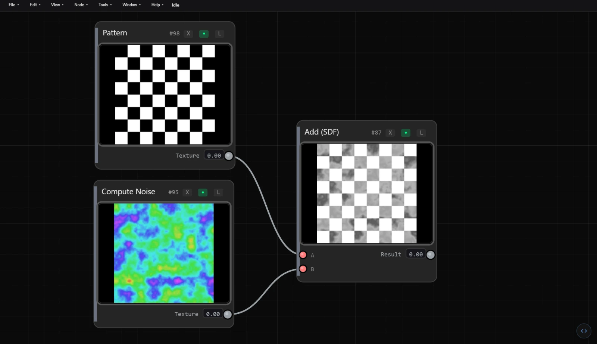
Adds two signed distance fields.

- **Category**: Blend
- **Inputs**:
  - `A` (float) - First SDF
  - `B` (float) - Second SDF
- **Outputs**:
  - `Result` (float) - Combined SDF
- **Description**: Combines two SDFs by adding their distance values together.

#### Subtract (SDF)

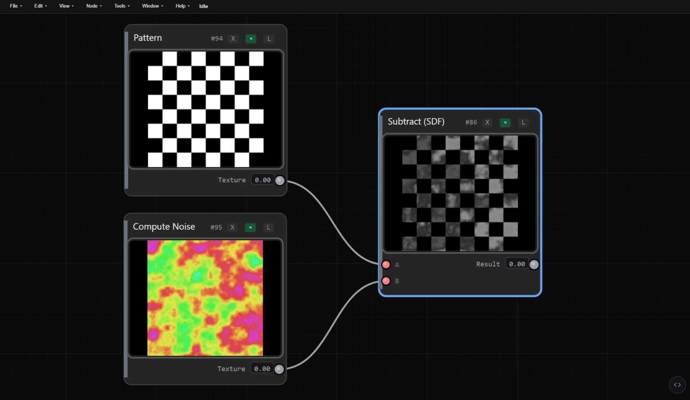
Subtracts one SDF from another.

- **Category**: Blend
- **Inputs**:
  - `A` (float) - Base SDF
  - `B` (float) - SDF to subtract
- **Outputs**:
  - `Result` (float) - Subtracted SDF
- **Description**: CSG subtraction operation - removes B from A. Creates negative space.

#### Union (Min)

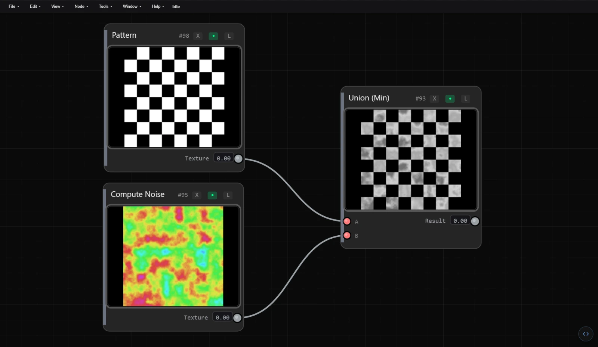
Creates a union of two SDFs.

- **Category**: Blend
- **Inputs**:
  - `A` (float) - First SDF
  - `B` (float) - Second SDF
- **Outputs**:
  - `Result` (float) - Union SDF
- **Description**: CSG union operation using minimum. Combines both shapes with a hard edge.

#### Intersection (Max)

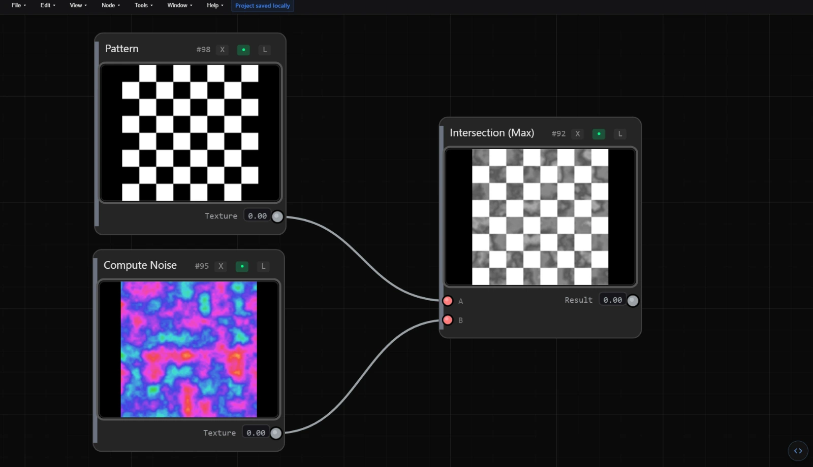
Creates an intersection of two SDFs.

- **Category**: Blend
- **Inputs**:
  - `A` (float) - First SDF
  - `B` (float) - Second SDF
- **Outputs**:
  - `Result` (float) - Intersection SDF
- **Description**: CSG intersection operation using maximum. Only shows regions where both shapes overlap.

### Smooth SDF Operations

#### Smooth Union

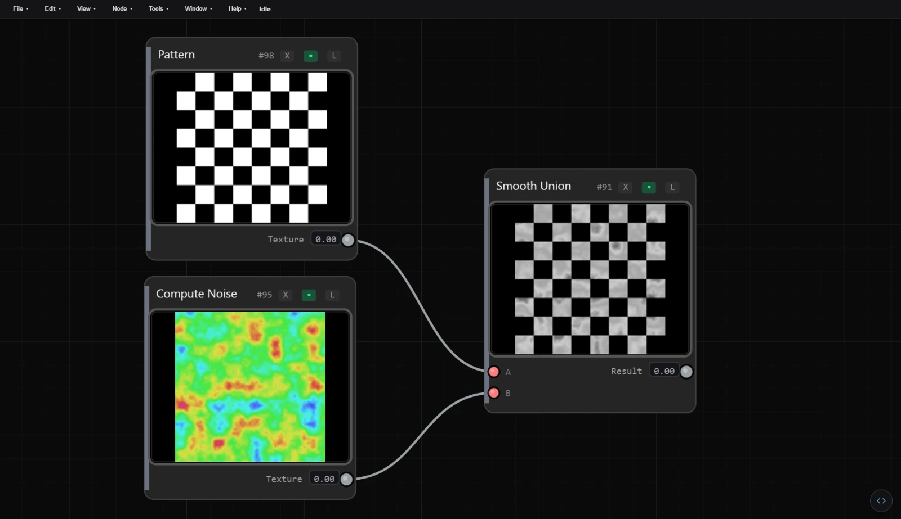
Creates a smooth union of two SDFs.

- **Category**: Blend
- **Inputs**:
  - `A` (float) - First SDF
  - `B` (float) - Second SDF
- **Outputs**:
  - `Result` (float) - Smooth union SDF
- **Parameters**:
  - `Smoothness` (slider, default: 0.1, range: 0.0-1.0) - Blend smoothness
- **Description**: CSG union with smooth blending between shapes. Creates organic-looking connections.

#### Smooth Intersection
Creates a smooth intersection of two SDFs.

- **Category**: Blend
- **Inputs**:
  - `A` (float) - First SDF
  - `B` (float) - Second SDF
- **Outputs**:
  - `Result` (float) - Smooth intersection SDF
- **Parameters**:
  - `Smoothness` (slider, default: 0.1, range: 0.0-1.0) - Blend smoothness
- **Description**: CSG intersection with smooth blending between shapes.

#### Smooth Subtraction
Creates a smooth subtraction of two SDFs.

- **Category**: Blend
- **Inputs**:
  - `A` (float) - Base SDF
  - `B` (float) - SDF to subtract
- **Outputs**:
  - `Result` (float) - Smooth subtraction SDF
- **Parameters**:
  - `Smoothness` (slider, default: 0.1, range: 0.0-1.0) - Blend smoothness
- **Description**: CSG subtraction with smooth blending at edges. Creates smooth negative space.

---

## Texture Nodes

Texture nodes sample image files.

#### Texture 2D

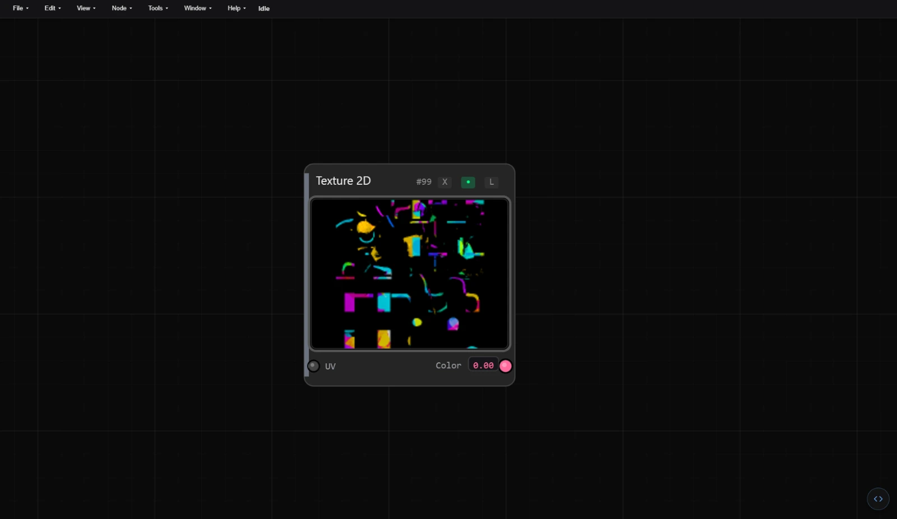
Samples a 2D texture image.

- **Category**: Texture
- **Inputs**:
  - `UV` - Texture coordinates
- **Outputs**:
  - `Color` (vec4) - Sampled color with alpha
- **Parameters**:
  - `Image` (file) - Image file to load
  - `Wrap U` (select: repeat/clamp/mirror, default: repeat) - Horizontal wrapping mode
  - `Wrap V` (select: repeat/clamp/mirror, default: repeat) - Vertical wrapping mode
  - `Filter` (select: linear/nearest, default: linear) - Texture filtering mode
- **Description**: Loads and samples a 2D texture image at the given UV coordinates, with configurable wrapping and filtering. Use a **Split Vec4** node to extract individual R/G/B/A channels.

#### Texture Cube
Samples a cubemap texture.

- **Category**: Texture
- **Inputs**:
  - `Dir` - Direction vector for sampling
- **Outputs**:
  - `Color` (vec4) - Sampled color with alpha
- **Parameters**:
  - `Cubemap` (file) - Cubemap image file
  - `Filter` (select: linear/nearest, default: linear) - Texture filtering mode
- **Description**: Samples a cubemap texture using a 3D direction vector, commonly used for environment mapping. Use a **Split Vec4** node to extract individual channels.

---

## Appendix

### Data Types

Rhizomium uses the following data types for node connections:

- **f32**: Single floating-point value (scalar)
- **vec2**: 2D vector (x, y)
- **vec3**: 3D vector (x, y, z) - typically used for RGB colors
- **vec4**: 4D vector (x, y, z, w) - typically used for RGBA colors
- **dynamic**: Type adapts to match input connections
- **Texture**: Compute node output — an image resource sampled by downstream nodes rather than a per-pixel value
- **control pin (f32)**: CPU-only scalar signal (e.g. the Reset pin on the Feedback nodes) — carries a trigger, not shader data

### Parameter Types

Nodes can have various parameter types:

- **float**: Floating-point number input
- **int**: Integer number input
- **bool/boolean**: True/false checkbox
- **select**: Dropdown menu with predefined options
- **file**: File upload (for textures)
- **expression**: Text input for mathematical expressions
- **glsl**: Multi-line shader code editor (Custom GLSL node)
- **colorstops**: Color gradient editor
- **color**: RGBA color picker
- **slider**: Ranged value slider
- **button**: One-shot action (e.g. Reset Feedback)

Numeric parameters also accept [parameter expressions](parameter-expressions.md) — type `=` followed by an expression (e.g. `=sin(time)*0.5+0.5`) to animate them.

### Tips for Using Nodes

1. **Type Matching**: Most mathematical operations work with both scalars and vectors. When mixing types, scalars are broadcast to match vector dimensions.

2. **UV Workflow**: Typical workflow starts with a UV node, applies transforms or generates patterns, then samples textures or creates procedural effects.

3. **Fragment vs. Compute**: Fragment nodes compile into a single shader and evaluate per pixel; compute nodes run in their own GPU pass and hand a texture downstream. Prefer compute nodes for stateful effects (feedback, simulations) and heavy image processing.

4. **Noise Layering**: Combine multiple noise nodes with different scales and amplitudes to create complex, natural-looking patterns.

5. **SDF Workflow**: Use shape generators to create basic shapes, then combine them with Blend nodes to create complex geometry through constructive solid geometry operations.

6. **Signal Workflow**: Trigger → Hold / Count / Reset pins form a small event system: Trigger converts continuous signals (audio, time, mouse) into pulses; Hold latches values, Count steps through values, and the Feedback nodes' Reset pins clear their state.

7. **Color Grading**: Use the Color Adjust compute node for brightness/contrast/saturation/hue/gamma/exposure in a single pass.

8. **Performance**: Nodes with many octaves (like FBM Noise) or high-resolution compute nodes can impact performance. Start with lower values and increase as needed.

9. **Debugging**: Use the UV to Color node to visualize coordinate spaces and transformations, and per-node preview thumbnails (the eye button) to inspect intermediate results.
