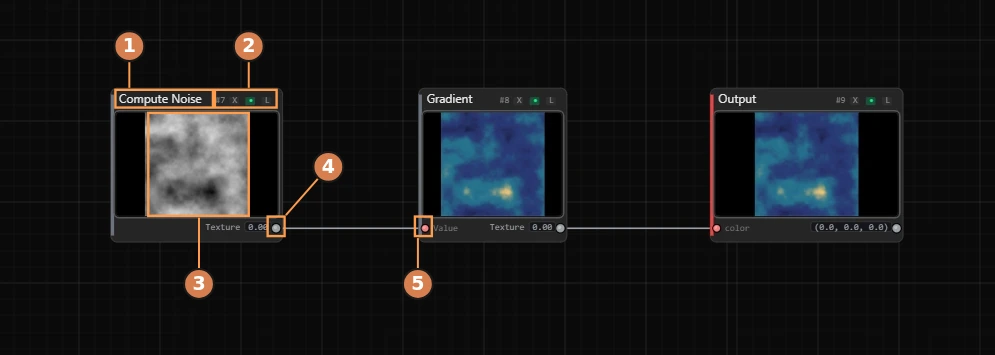

# Node System

Understanding the node-based architecture of Rhizomium.

---

## Overview

Rhizomium uses a **node-based visual programming system** where you build shader programs by connecting nodes together. Each node performs a specific operation, and the connections between nodes define how data flows through your visual composition.

---

## Node Anatomy



1. **Node title** - the node's type
2. **Header controls** - node id, hide info (X), toggle thumbnail (eye), cycle preview size (S/M/L)
3. **Preview thumbnail** - this node's own output
4. **Output pin** - drag from here to connect
5. **Input pin** - drop a wire here

Every node has the same basic structure:

```
┌─────────────────┐
│   Node Title    │  ← Header with node name
├─────────────────┤
│ ○ Input 1    ○  │  ← Input pins (left) and output pins (right)
│ ○ Input 2       │
│                 │
│  [Parameters]   │  ← Adjustable parameters
│  [   slider]    │
└─────────────────┘
```

### Components

- **Header** - The node's name/type. Click to select, drag to move.
- **Input Pins** (left side) - Receive data from other nodes
- **Output Pins** (right side) - Send data to other nodes
- **Parameters** - Adjustable values that control the node's behavior
- **Body** - Contains the parameter controls

---

## Data Flow

Data flows from **left to right** through your node graph:

```
[Input Nodes] → [Processing Nodes] → [Output Node]
     UV       →    Circle/Noise    →    ColorRamp → Output
     Time     →    Math Operations →
```

### Connection Rules

1. **Output → Input**: Always connect from output (right) to input (left)
2. **Type Compatibility**: Pins must have compatible data types
3. **No Cycles**: Nodes cannot connect back to themselves
4. **Multiple Outputs**: One output can feed multiple inputs
5. **Single Inputs**: Each input accepts only one connection

---

## Data Types

Rhizomium uses WGSL data types:

| Type | Description | Example Values |
|------|-------------|----------------|
| **f32** | Single floating-point number | `0.5`, `3.14`, `-1.0` |
| **vec2** | Two numbers (2D vector) | `(0.5, 0.5)`, UV coordinates |
| **vec3** | Three numbers (3D vector/RGB) | `(1.0, 0.5, 0.0)` red-orange |
| **vec4** | Four numbers (RGBA) | `(1.0, 0.0, 0.0, 1.0)` red |

### Type Conversion

Rhizomium automatically converts between compatible types:

- **f32 → vec2/vec3/vec4**: Fills all components with the same value
- **vec2 → vec3/vec4**: Adds default values for missing components
- **vec3 → vec4**: Adds alpha = 1.0
- **vec4 → vec3**: Drops alpha channel

---

## Node Categories

Rhizomium organizes nodes into 12 categories (as shown in the add-node menu). Several categories contain both fragment nodes and GPU compute nodes — see [Compute Nodes Guide](compute-nodes.md) for how compute nodes differ.

### 1. Input Nodes
Provide data sources, constants, and CPU-side signal utilities.

**Examples**: UV, Time, Mouse, Resolution, Float constants, Trigger, Hold, Count, Random Value

**Use**: Starting points for your graph

### 2. Output Nodes
Final rendering output.

**Examples**: Output (the only one!)

**Use**: End point of your graph

### 3. Math Nodes
Perform mathematical operations.

**Examples**: Add, Multiply, Sin, Cos, Clamp

**Use**: Transforming and combining values

### 4. Vector Nodes
Construct, deconstruct, and rearrange vectors.

**Examples**: Split Vec2/3/4, Combine Vec2/3/4, Swizzle

**Use**: Working with individual vector/color components

### 5. Generator Nodes
Generate patterns and procedural content.

**Examples**: Circle, Rectangle, Polygon, Perlin/Simplex/FBM Noise, Color Ramp, Compute Noise, Gradient, Pattern, Voronoi

**Use**: Creating visual patterns and shapes

### 6. Transform Nodes
Manipulate UV coordinates and space.

**Examples**: Rotate 2D, Scale 2D, Tile and Offset, Polar Coordinates, Twirl, Displacement

**Use**: Warping and distorting space

### 7. Modifier Nodes
Adjust and process colors and textures.

**Examples**: To Grayscale, Invert Color, Color Mix, Compute Blur, Color Adjust, Edge Detect, Threshold

**Use**: Color grading and image processing

### 8. Effect Nodes
GPU compute effects.

**Examples**: Compute Feedback, Warp, Kaleidoscope, Glitch

**Use**: Trails, distortion, mirror, and glitch effects

### 9. Dynamics Nodes
Stateful systems that evolve frame to frame on the GPU.

**Examples**: Compute Particles, Reaction Diffusion, Fluid Flow, Cellular Automata, Feedback Field

**Use**: Particle systems and physics-based visuals

### 10. Utility Nodes
Data manipulation, logic, and texture compositing.

**Examples**: Expression, Remap, Select, Compare, Switch, Custom GLSL, Mix, Channels, HSV

**Use**: Converting and adjusting data, custom code

### 11. Blend Nodes
Combine signed distance fields (SDFs).

**Examples**: Union, Intersection, Smooth Blend

**Use**: Combining multiple shapes

### 12. Texture Nodes
Sample image files.

**Examples**: Texture 2D, Texture Cube

**Use**: Bringing images and cubemaps into the graph

---

## Common Workflows

### Basic Pattern Creation

```
UV → Generator Node → ColorRamp → Output
```

Create a simple pattern with color.

### Animated Pattern

```
UV → Generator Node → \
                   Add → ColorRamp → Output
Time → Sine →     /
```

Add time-based animation to a pattern.

### Layered Composition

```
UV → Generator 1 → ColorRamp 1 → \
                              Mix → Output
UV → Generator 2 → ColorRamp 2 → /
```

Blend multiple patterns together.

### Space Transformation

```
UV → Transform → Generator → ColorRamp → Output
```

Warp space before applying a pattern.

---

## Parameter Types

Nodes can have various parameter types:

### Numeric Parameters
- **float**: Decimal number with slider
- **int**: Integer number
- **boolean**: On/off checkbox

### Selection Parameters
- **select**: Dropdown menu with options
- **mode**: Choose between different algorithms

### Complex Parameters
- **colorstops**: Gradient editor with color stops
- **expr**: Expression input (for Expression node)
- **glsl**: Shader code editor (for Custom GLSL node)
- **button**: One-shot action (e.g. Reset Feedback)

Numeric parameters also accept [parameter expressions](parameter-expressions.md) — type `=` followed by an expression to animate them.

---

## Node Tips

### Organizing Your Graph

1. **Left to Right Flow**: Keep inputs on the left, outputs on the right
2. **Group Related Nodes**: Keep connected nodes close together
3. **Use Space**: Don't crowd nodes - spread them out for clarity
4. **Name Important Nodes**: Double-click headers to rename

### Performance Optimization

1. **Minimize Complexity**: Fewer nodes = better performance
2. **Expensive Nodes**: Noise, Voronoi, and FBM are GPU-intensive
3. **Reuse Calculations**: Connect one output to multiple inputs instead of duplicating nodes
4. **Simplify Math**: Combine operations when possible

### Debugging

1. **Isolate Sections**: Disconnect parts of your graph to test
2. **Visualize Intermediate Steps**: Connect intermediate results to Output
3. **Check Value Ranges**: Use Clamp to ensure values stay in bounds
4. **Use Simple Shapes First**: Start with Circle or Gradient before complex patterns

---

## Node Reference

For a complete catalog of all nodes with detailed specifications, see the **[Node Reference](node-reference.md)**.

---

## Next Steps

- **[Node Reference](node-reference.md)** - Complete node catalog
- **[Your First Graph](guide.md)** - Step-by-step tutorial
- **[Shader Compilation](shader-compilation.md)** - How nodes become shaders

---

_Ready to explore? Open the [Node Reference](node-reference.md) to see all available nodes._
