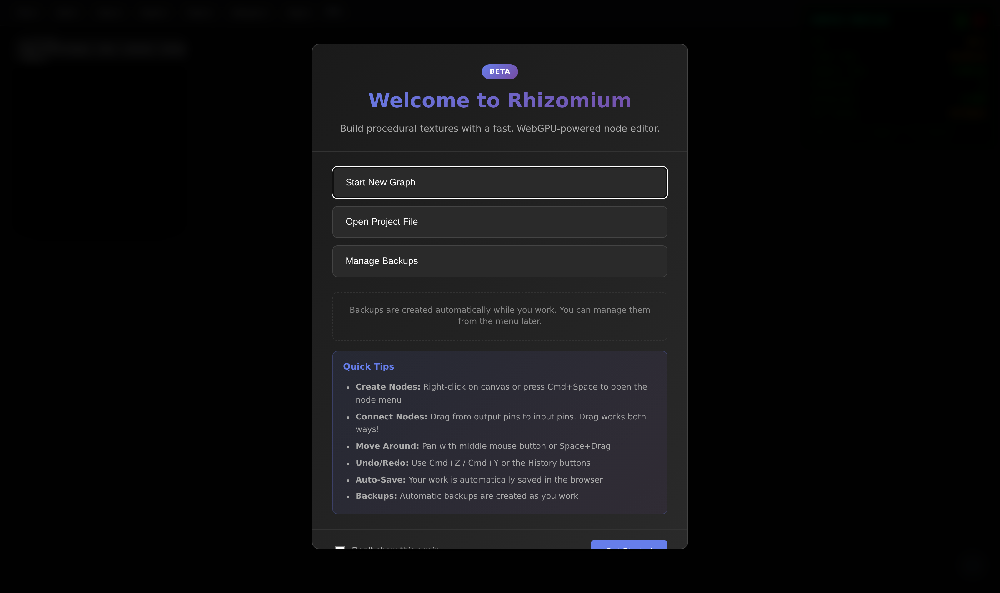
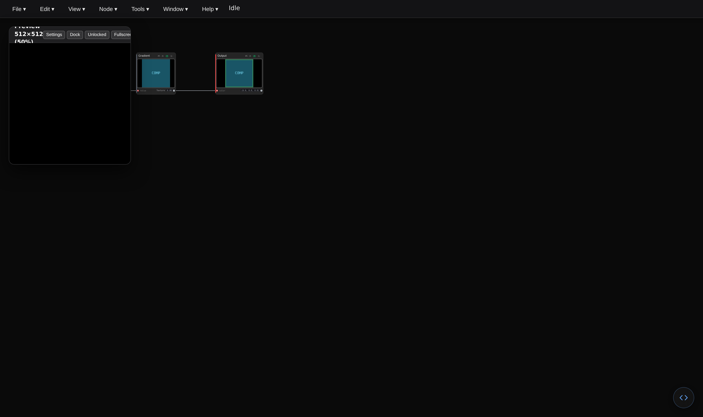
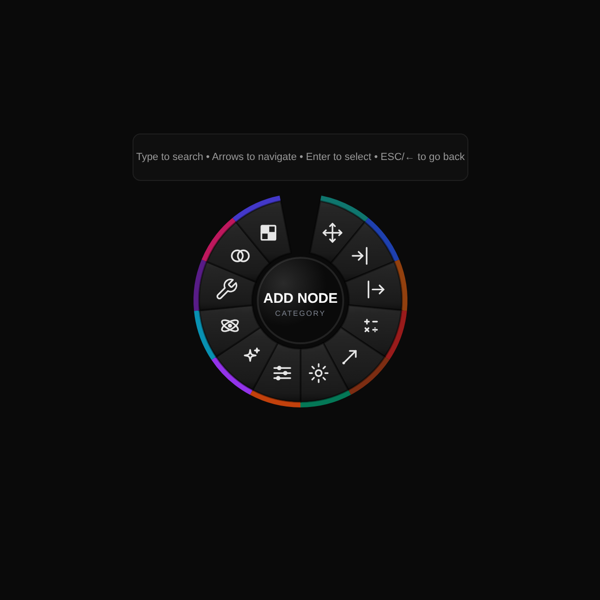
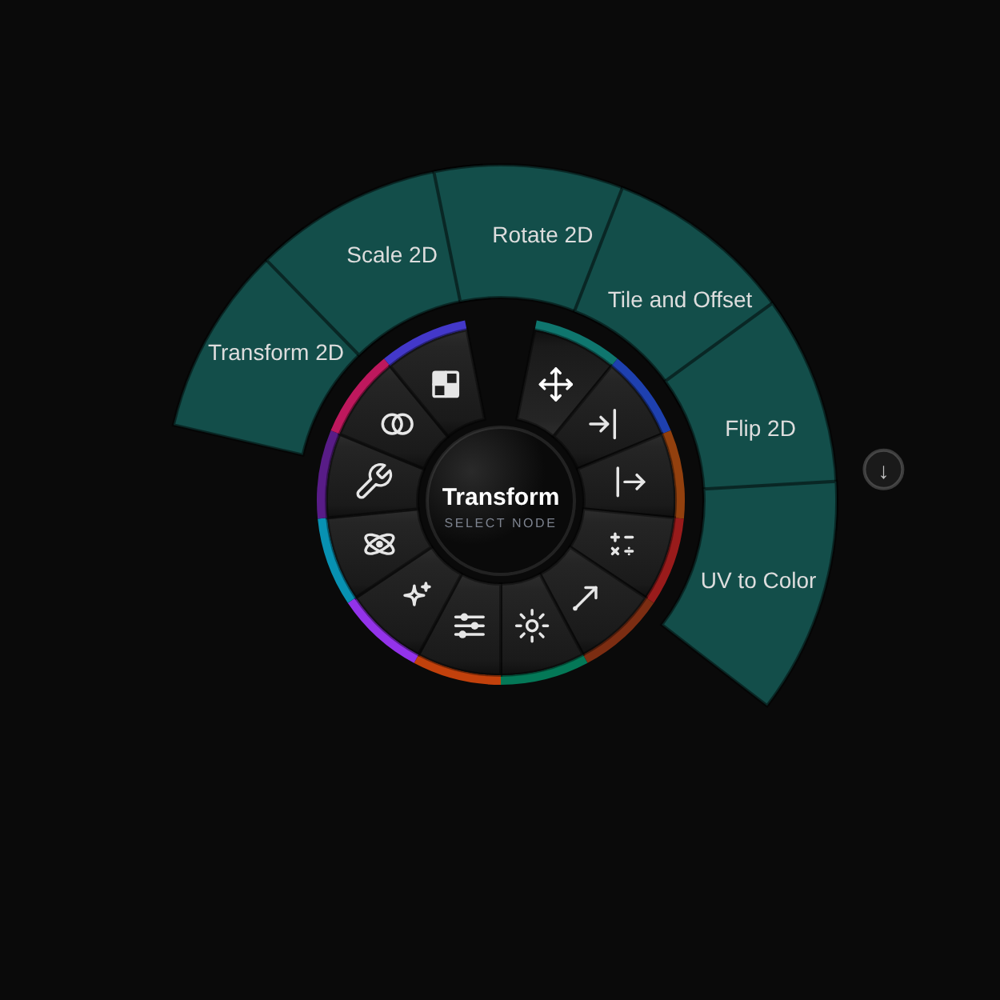
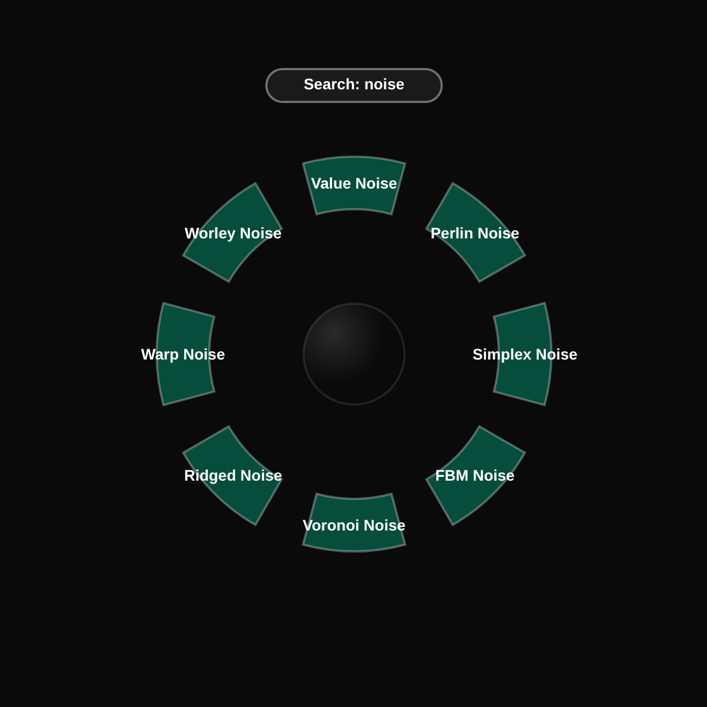
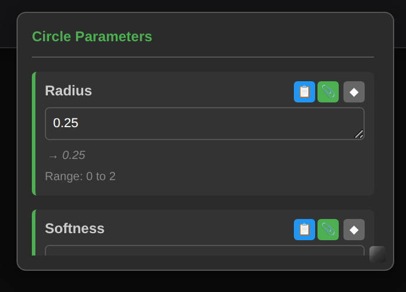

# Quick Start Guide

Get started with Rhizomium in just 5 minutes! This guide will help you create your first visual.

---

## Step 1: Open Rhizomium

Visit **[https://studio.tenderworld.org/](https://studio.tenderworld.org/)** in Chrome or Edge.

A welcome dialog greets you on first load:

Choose **Start New Graph**. (**Open Project File** loads a `.json` you exported
earlier, and **Manage Backups** opens the autosaves the editor keeps as you work.)

You then land in the editor:

- **Menu bar** across the top: File, Edit, View, Node, Tools, Window, Help
- **Canvas** filling the window, where you build the graph
- **Preview window**, floating over the canvas at the top left
- **Status text** next to the menus, showing "Idle" or "Shader compiled"

A new graph is not empty - it starts with **Compute Noise → Gradient → Output**
already wired up, so there is something on screen immediately.

**No installation required** - it runs entirely in your browser!

---

## Step 2: Create Your First Nodes

Let's build a circle from scratch. Start by deleting the three starter nodes
(box-select them with a right-click drag, then press Delete).

### The Add Node menu

**Right-click** anywhere on the canvas. The **Add Node** menu opens as a ring of
the twelve categories:

Click a category to fan out the nodes inside it:

You do not have to hunt through categories, though. With the menu open, **just
start typing** and it filters every node by name:

Arrow keys move the selection, **Enter** places the highlighted node, and
**Esc** (or the left arrow) steps back out.

### Add a UV node

1. **Right-click** on the canvas
2. Type `uv`, or click the **Input** category and pick **UV**
3. Press **Enter** to place it

The UV node provides coordinates for every pixel on the screen.

### Add a Circle node

1. **Right-click** again, to the right of the UV node
2. Type `circle`, or open the **Generators** category
3. Place the **Circle** node

### Connect them

1. Click and drag from the **UV output** (right side)
2. Connect to the **Circle input** (left side)

You've made your first connection!

---

## Step 3: Add Color

### Add a Gradient node

1. Right-click → type `gradient` (it lives under **Generators**)
2. Place it to the right of Circle
3. Connect **Circle output** to the **Gradient** input

### Customize the colors

1. Double-click the Gradient node to open its parameters
2. Adjust the colour stops and the gradient's type and angle
3. Changes apply to the preview as you make them

---

## Step 4: Output Your Visual

### Add an Output node

1. Right-click → type `output` (category **Output**)
2. Place it at the far right
3. Connect **Gradient output** to the **Output** input

**You should now see your visual in the preview!**

---

## Step 5: Make It Animate

The Circle node takes a single input - its **Radius** is a *parameter*, not a
pin, so you animate it with an expression rather than by wiring a node into it.

1. **Double-click** the Circle node to open its parameters
2. Click into the **Radius** field
3. Type `=sin(time) * 0.15 + 0.3`

The line under the field shows the value the expression currently evaluates to,
and the range the parameter accepts. Watch your circle pulse with time!

Parameters that take expressions can reference `time`, `audioEnvelope`,
`mouse.x` and more - see [Parameter Expressions](parameter-expressions.md).

---

## Step 6: Experiment!

Now that you have the basics, try:

### Change Parameters
- Double-click a node to open its parameters
- Try different values for the Circle's Radius and Softness
- Adjust the Gradient's colour stops

### Try Different Nodes
- Replace Circle with **Perlin Noise** or **Voronoi Noise**
- Add a **Rotate 2D** or **Scale 2D** transform
- Use **Math** nodes to combine values

### Add Audio Reactivity
- Open **Tools → Audio Settings** and enable the microphone
- Type `=audioEnvelope * 0.5` into a parameter field (e.g. the Circle's Radius)
- Play some music!

---

## Common Controls

- **Add Node**: Right-click, then type to search or pick a category
- **Delete Node**: Select node → Press Delete or Backspace
- **Pan Canvas**: Middle-click drag or drag with two fingers
- **Zoom**: Mouse wheel or pinch
- **Save**: Ctrl+S, or **File → Save**
- **Undo**: Ctrl+Z

---

## Next Steps

Ready to learn more?

1. **[Your First Graph](guide.md)** - Detailed step-by-step tutorial
2. **[Interface Overview](interface.md)** - Learn all the features
3. **[Node Reference](node-reference.md)** - Explore all 133 nodes
4. **[Parameter Expressions](parameter-expressions.md)** - Animate with math formulas
5. **[Compute Nodes](compute-nodes.md)** - GPU-accelerated effects
6. **[Audio Reactivity](audio-web.md)** - Make visuals react to sound
7. **[MIDI Controllers](midi.md)** - Control with hardware
8. **[Timeline Animation](timeline.md)** - Create keyframe animations

---

## Need Help?

- **Black preview?** Make sure you have an Output node connected
- **Can't add nodes?** Try right-clicking on an empty area
- **Browser not supported?** Use Chrome 113+ or Edge 113+
- **More questions?** Check the **[FAQ](faq-web.md)**

---

**Tip**: Save your work frequently with Ctrl+S!

---

_Happy creating! Share your visuals with the world._
